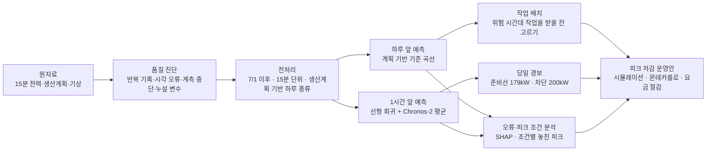
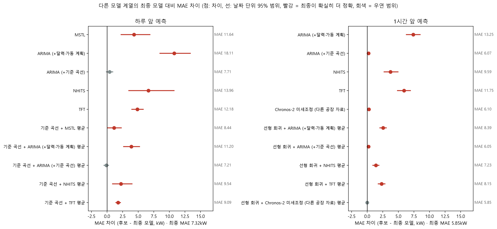

# 제조 생산데이터 기반 전력사용량 예측 및 최대피크 위험조건 분석

볼트·너트 공장의 **15분 전력을 하루 앞·1시간 앞으로 예측**하고, 전기 기본요금을 정하는 **최대피크가 생기는 조건을 찾아 낮추는 운영안**을 만든 프로젝트입니다.
제6회 K-인공지능 제조데이터 분석 경진대회(KAMP) 주제 ⑤로 진행했습니다.

- **팀**: 서울메이트 (임준서, 이태연)
- **환경**: Python 3.12, CPU만 사용 (GPU 없음)
- **상세 결과**: [REPORT.md](REPORT.md) · [docs/분석_상세.md](docs/분석_상세.md)

## 핵심 결과

| 항목 | 결과 |
|---|---|
| 하루 앞 15분 전력 예측 | MAE **7.32kW** (상대오차 7.0%). 달력 기반 예측 14.47kW의 절반 |
| 1시간 앞 15분 전력 예측 | MAE **5.85kW** (상대오차 5.6%). 직전 값을 그대로 쓰는 방법 14.48kW 대비 60% 감소 |
| 1시간 앞 피크 경보 | 피크 구간의 **77%** 를 미리 알림. 같은 재현율의 단순 규칙보다 경보 구간 **44%** 적음 |
| 피크 저감 시뮬레이션 | 옮길 수 있는 부하 10% 가정 시 여름 최대 **222 → 203.5kW**, 기본요금 연 약 160만 원 절감 (요금제 변경 포함 시 약 346만 원) |
| 데이터 진단 | 257일 중 160일(62%)이 다른 날과 똑같은 반복 기록. 그대로 쓰면 오차가 7.60 → 13.52kW로 커짐 |

## 문제 정의

공장의 전기 기본요금은 **15분 평균 전력의 최댓값(최대수요전력)** 으로 정해지고, 여름에 생긴 한 번의 피크가 이후 최대 12개월 동안 요금에 반영됩니다. 그래서 평균 오차만이 아니라 **요금을 정하는 피크를 언제 놓치는지**를 함께 평가했습니다.

| 예측 | 쓰임 | 평가 |
|---|---|---|
| 하루 앞 (다음 날 96칸) | 다음 날 작업 배치, 위험 시간대 작업 옮기기 | MAE, RMSE, 고부하 구간 MAE, 하루 최대 오차 |
| 1시간 앞 (다음 4칸) | 당일 피크 경보 | MAE, 경보 재현율·정밀도·F1, 하루 경보 수 |

## 활용 데이터

| 자료 | 내용 | 쓰임 |
|---|---|---|
| **KAMP 자원 최적화 AI 데이터셋** (중소벤처기업부·KAIST, 2021) | 2021-01-01 ~ 09-14, 257일 · 6,168행(1시간) · 18개 변수. 1시간마다 15분 전력 4개, 생산계획(ERP), 기상청 관측(기온·습도 등), 인건비·요금 구분 | 예측 대상과 입력 |
| 독일 산업체 50곳 15분 부하 (Zenodo, CC BY 4.0) | 2016·2017년 1년치 | Chronos-2 LoRA 미세조정 학습 자료 |
| 한국 철강 공장 15분 전력 (UCI, CC BY 4.0) | 2018년 1년치 | 위와 같음 |
| Chronos-2 사전학습 가중치 (Apache-2.0) | 시계열 기반 모델 | 1시간 앞·하루 앞 예측 후보 |
| 한전 전기요금표(2021)·공급약관, 공휴일 규정 | 요금 시간대, 선택Ⅰ·Ⅱ 단가 | 피크 정의, 절감액 계산 |

원자료는 이용 조건 때문에 저장소에 올리지 않았습니다. 받는 방법은 [data/README.md](data/README.md), 외부 자료 사용 방법은 [docs/데이터와_외부자료.md](docs/데이터와_외부자료.md)에 있습니다.

### 데이터 진단에서 찾은 문제

| 문제 | 내용 | 처리 |
|---|---|---|
| 똑같은 날의 반복 | 160일(62%)이 다른 날과 하루 전력 기록이 완전히 같음. 1~6월에 몰림 | 7/1 이후 실측 구간만 사용 |
| 시간 순서가 깨진 날 | 7/13, 7/15의 시간 열에 정렬된 값이 들어감 | 두 날 제외 |
| 계측 중단 | 8/28 18시 ~ 8/29 10시 연속 0 | 결측 처리, 평가 제외 |
| 정답 누설 변수 | `공장인원 = 생산량 ÷ 전력 합`(3,511행 모두 일치), `평균` = 정답의 평균 | 입력에서 제외 |
| 시간대·계절 표시 변수 | `인건비`·`전기요금`은 시각·월과 같은 정보이고 요금 계절 표기가 어긋남 | 입력에서 제외, 요금은 요금표로 계산 |


## 분석 구조




## 방법론

### 1. 평가 설계: 5주 시간순 평가

과거로 학습해 미래로 시험하는 방식을 5번 반복했습니다. 각 시험 주는 그 이전 데이터로만 다시 학습하고, 평가 기간은 8/9 ~ 9/14(37일, 약 3,480칸)입니다.


데이터를 잘못 나누면 성능이 얼마나 부풀려지는지도 같은 모델로 확인했습니다.

| 데이터 사용 방식 | 기준 곡선 MAE | LightGBM MAE | 시험일 중 학습에 똑같은 날이 있는 비율 |
|---|---|---|---|
| 1~9월 전체 + 날짜 무작위 분할 | 16.98 | 17.13 | 61% |
| 1~9월 전체 + 시간순 분할 | 13.52 | 13.56 | 0% |
| **7/1 이후만 + 시간순 분할 (채택)** | **7.60** | **7.78** | 0% |

### 2. 핵심 아이디어: 생산계획으로 하루 종류 나누기

전력은 '오늘 가동하는가'와 '몇 시인가'로 대부분 정해집니다. 요일·공휴일 달력 대신 **생산계획으로 평일 가동·토요일·휴일**을 구분하고, **전날 가동 여부**(월요일 오전 기동 피크)를 더해 시각별 과거 평균을 낸 것이 하루 앞 기준 곡선입니다. 이 하나로 하루 앞 오차가 14.47 → 7.32kW가 됐습니다.

1시간 앞은 기준 곡선에 **지금 얼마나 벗어나 있는지(현재 편차)** 를 더하는 선형 회귀(예측 ≈ 기준 곡선 + 0.53 × 현재 편차)와, 직전 3주 기록과 가동 계획을 넣은 Chronos-2를 50:50으로 평균했습니다. 두 모델이 서로 반대로 틀리는 구간이 많아 평균이 각각보다 정확했습니다.

### 3. 모델 선택 규칙

단순 기준부터 머신러닝, 통계 모델, 딥러닝, 사전학습 모델까지 같은 5주 평가로 비교했습니다. **날짜 단위 부트스트랩 95% 범위와 Diebold–Mariano 검정에서 개선이 확인될 때만** 더 복잡한 모델을 택했습니다. 앞 주 결과만으로 매주 모델을 다시 고르는 실험에서도 MAE가 0.09(하루 앞)·0.15kW(1시간 앞)만 커져, 같은 기간으로 모델을 고른 데 따른 선택 편향은 작았습니다.

| 계열 | 모델 |
|---|---|
| 단순 기준 | 지난주 같은 시각, 최근 4주 같은 요일, 직전 값, 달력 기반 평균 곡선 |
| 계획 기반 | 생산계획 기반 기준 곡선, 기준 곡선 + 현재 편차, 칼만 필터 보정 |
| 머신러닝 | 선형 회귀(Ridge), LightGBM (입력 정보별 실험 포함) |
| 통계 모델 | MSTL, ARIMA (달력·가동 계획 또는 기준 곡선을 외생 변수로) |
| 딥러닝 | NHITS, TFT |
| 사전학습 모델 | Chronos-2 (추가 학습 없음, 공변량 투입), 다른 공장 자료로 LoRA 미세조정한 Chronos-2 |
| 결합 | 기준 곡선·선형 회귀와 각 모델의 평균 |

## 모델 성능 비교

평가 기간 8/9 ~ 9/14, 단위 kW. '최종 대비 차이'는 후보 MAE − 최종 MAE와 날짜 단위 부트스트랩 95% 범위입니다(범위가 0을 포함하면 우연 범위).

### 하루 앞 예측

| 모델 | MAE | RMSE | 고부하 구간 MAE | 최종 대비 차이 (95% 범위) |
|---|---|---|---|---|
| 지난주 같은 시각 | 23.68 | 46.86 | 65.23 | — |
| 달력 기반 평균 곡선 | 14.47 | — | 32.62 | — |
| NHITS | 13.96 | 22.85 | 32.39 | +6.64 (3.51 ~ 10.77) |
| TFT | 12.18 | 19.65 | 9.59 | +4.86 (3.97 ~ 5.74) |
| MSTL | 11.64 | 17.18 | 24.98 | +4.32 (2.26 ~ 6.87) |
| LightGBM (+과거 전력) | 10.84 | 16.30 | 21.42 | — |
| 최근 4주 같은 요일 | 9.16 | 13.95 | 11.78 | — |
| LightGBM (달력 + 계획) | 8.94 | 12.95 | 10.42 | — |
| ARIMA (+기준 곡선) | 7.71 | 11.36 | 8.67 | +0.39 (−0.10 ~ 0.92) |
| Chronos-2 (+가동 계획) | 7.54 | 11.32 | 10.98 | +0.22 (−0.48 ~ 1.05) |
| **계획 기반 기준 곡선 (최종)** | **7.32** | **10.98** | **7.99** | — |
| 기준 곡선 + ARIMA 평균 | 7.21 | 10.88 | 8.19 | −0.11 (−0.50 ~ 0.23) |
| 기준 곡선 + Chronos-2 평균 | 7.10 | 10.72 | 9.09 | −0.22 (−0.59 ~ 0.20) |

기준 곡선보다 MAE가 낮은 결합 모델도 있었지만 차이가 우연 범위 안이고 고부하 구간은 오히려 나빠, 가장 단순한 기준 곡선을 택했습니다.

### 1시간 앞 예측

| 모델 | MAE | RMSE | 고부하 구간 MAE | 최종 대비 차이 (95% 범위) |
|---|---|---|---|---|
| 직전 값 그대로 | 14.48 | 23.59 | 22.56 | +8.46 |
| TFT | 11.75 | 19.25 | 9.85 | +5.90 (4.81 ~ 6.91) |
| NHITS | 9.59 | 14.58 | 17.90 | +3.75 (2.71 ~ 4.93) |
| 계획 기반 기준 곡선 | 7.32 | 10.98 | 7.99 | +1.48 |
| LightGBM | 6.52 | 9.56 | 9.07 | +0.67 (0.39 ~ 1.00) |
| 칼만 필터 보정 | 6.36 | 9.51 | 8.12 | +0.51 (0.24 ~ 0.80) |
| 기준 곡선 + 현재 편차 | 6.35 | 9.51 | 7.84 | +0.50 (0.26 ~ 0.78) |
| 선형 회귀 (Ridge) | 6.26 | 9.12 | 8.33 | +0.42 (0.21 ~ 0.62) |
| Chronos-2 미세조정 (다른 공장 자료) | 6.10 | 9.27 | 9.86 | +0.25 (0.08 ~ 0.43) |
| ARIMA (+기준 곡선) | 6.07 | 8.93 | 7.86 | +0.22 (0.01 ~ 0.39) |
| Chronos-2 (+가동 계획) | 6.06 | 9.27 | 9.37 | +0.22 (0.05 ~ 0.41) |
| **선형 회귀 + Chronos-2 평균 (최종)** | **5.85** | **8.53** | **8.40** | — |

다른 공장 자료로 미세조정한 Chronos-2는 미세조정 전보다 나아지지 않았습니다(6.06 → 6.10, 학습 파라미터 1.00%).



### 피크 경보 (1시간 앞, 189kW 초과 칸)

| 경보 방식 | 재현율 | 정밀도 | F1 | 가동일 하루 경보 칸 |
|---|---|---|---|---|
| **최종 모델 + 여유값 10kW** | **0.77** | **0.19** | **0.30** | **11.3** |
| 과거 초과율 규칙 (재현율 맞춤) | 0.77 | 0.10 | 0.18 | 20.0 |
| 달력 규칙 (위험 시간대 전부 경보) | 0.98 | 0.10 | 0.17 | 28.0 |

반면 하루 앞 예측으로 '피크를 넘는 날'을 가려내는 성능은 AUC 0.42로 낮았습니다. 그래서 요금을 정하는 피크는 예측에만 맡기지 않고 고정 규칙으로 막는 방향을 택했습니다.

## 오차와 피크가 생기는 조건

- 오차는 **평일 주간(08~19시)** 에 몰렸습니다(하루 앞 MAE 11.52kW, 휴일 1.38kW). 특히 대체공휴일 가동, 휴무 직후처럼 평소와 다르게 운영한 날에 컸습니다.
- 피크는 **평일 08~16시**와 **월요일(전날 휴무) 오전 기동** 때 생깁니다.
- 생산량은 '개수' 단위라 전력과 관계가 약했고, 이 표본에서는 기온 효과도 확인되지 않았습니다.


## 피크 저감 운영안

'평일 위험 시간대(08~12시, 13~16시)에는 배치형 작업을 하지 않는다'는 고정 규칙으로 피크를 막고, 예측은 옮긴 작업을 받을 시간 배치와 당일 경보에 씁니다.

| 시나리오 (옮길 수 있는 부하 10%) | 여름 최대 (kW) | 줄어든 최대 (kW) |
|---|---|---|
| **A1. 고정 규칙형** | 222 → **203.5** | **18.5** |
| A2. 예측 기반형 (예측이 높은 날만 옮김) | 222 → 222 | 0 |
| B. 경보 대응형 (8/16 이후) | 204 → 198 | 6 |
| C. 순차 기동 | 222 → 222 | 0 |

- 기본요금 절감: 연 약 **160만 원**(산업용(을) 고압A 선택Ⅰ), 요금제를 선택Ⅱ로 함께 바꾸면 연 약 **346만 원** (2021년 요금표, 계약 조건 가정)
- 규칙 준수율을 바꾼 몬테카를로 4,000회에서 **주의일(월요일·휴무 직후)만 반드시 지키면** 절감이 0이 되는 경우가 없었습니다.
- 매시 판단 기록과 규칙 기반 질의응답을 하는 피크 관리 도우미(`notebooks/peak_helper.py`)를 함께 만들었습니다.


## 기술 스택

| 분야 | 사용 도구 |
|---|---|
| 데이터 처리·시각화 | pandas, NumPy, SciPy, matplotlib, seaborn |
| 머신러닝·해석 | scikit-learn, LightGBM, SHAP |
| 시계열 모델 | statsforecast (MSTL, ARIMA), neuralforecast (NHITS, TFT) |
| 사전학습 모델 | Chronos-2 (PyTorch, transformers), PEFT LoRA 미세조정 |
| 검증·재현 | 날짜 단위 부트스트랩, Diebold–Mariano 검정, 몬테카를로, pytest, papermill |

## 저장소 구조

```
├── notebooks/                  분석 노트북 12개 (실행 결과 포함)
│   ├── 01-1, 01-2              데이터 진단, 전처리와 평가 설계
│   ├── 02-1, 02-1b, 02-1c      Chronos-2, 통계·딥러닝 모델, 외부 자료 미세조정
│   ├── 02-2 ~ 02-4             모델 비교·선정, 경보와 오류 분석, 피크 위험 확률
│   ├── 03-1                    영향요인(SHAP)과 놓친 피크 조건
│   ├── 04-1, 04-2              피크 저감 운영안, 피크 관리 도우미
│   ├── 06                      테스트 예측결과 생성
│   └── peak_helper.py, hourly_utils.py
├── appendix/hourly_max_pipeline/   1시간 최대를 직접 예측한 별도 파이프라인 (모델 15종 이상)
├── outputs/
│   ├── figures/                그림
│   ├── tables/                 결과표 (t01 ~ t58)
│   └── predictions/            저장된 Chronos-2·추가 모델 예측
├── tests/                      정보 누설·평가 범위·도우미 자동 점검 (18개)
├── data/                       원자료 받는 법
├── docs/                       분석 상세, 실행과 재현성, 데이터와 외부 자료, 참고 자료
├── run_all.py                  전체 노트북 자동 실행
└── REPORT.md                   결과보고서
```

노트북별 내용은 [docs/분석_상세.md](docs/분석_상세.md)에 있습니다.

## 실행 방법

```
python -m venv .venv
.venv/Scripts/python -m pip install -r requirements.txt   # macOS·Linux: .venv/bin/python
python run_all.py            # 전체 실행(약 10분, 02-1 계열은 저장된 예측 사용)
python run_all.py --check    # 실행 전후 결과표 비교
python -m pytest tests -q    # 자동 점검
```

원자료를 [data/README.md](data/README.md)대로 `data/raw/`에 둔 뒤 실행합니다. Chronos-2 예측 재계산(`--with-chronos`), 부록 실행, 실행 시간과 재현성 확인 결과는 [docs/실행과_재현성.md](docs/실행과_재현성.md)에 있습니다.

## 한계

- 실측 구간이 7~9월 74일뿐이라 겨울 피크와 계약전력은 확인하지 못했습니다.
- 설비별 계측이 없어 옮길 수 있는 부하(10%)는 여러 방법으로 추정한 가정값입니다.
- 222kW가 여러 날 반복되고 넘는 값이 없어 계측 상한일 가능성이 있습니다.

## 데이터 출처

중소벤처기업부, Korea AI Manufacturing Platform(KAMP), 자원 최적화 AI 데이터셋, KAIST, 2021.12.27., www.kamp-ai.kr
