# 제조 생산데이터 기반 전력사용량 예측 및 최대피크 위험조건 분석

**제6회 K-인공지능 제조데이터 분석 경진대회 주제 ⑤ 결과보고서**  
**프로젝트명:** 생산계획 기반 15분 전력 예측과 피크 저감 운영안  
**팀명:** 서울메이트 · **팀장:** 임준서 · **팀원:** 이태연

## 내용 요약

본 분석은 볼트·너트 공장의 15분 전력을 예측하고, 최대수요전력을 낮출 수 있는 운영 방법을 제안한다. 전기요금의 기본요금은 사용량뿐 아니라 최대수요전력에도 영향을 받으므로, 평균적인 예측 정확도와 함께 피크를 놓치는 상황까지 살펴보았다.

먼저 데이터의 반복 기록과 계측 이상을 점검하였다. 전체 257일 중 160일에서 다른 날과 동일한 기록이 발견되어, 반복 기록이 집중된 1~6월을 제외하고 7~9월을 분석에 사용하였다. 이를 바탕으로 생산계획에 따른 가동 여부와 시간대를 반영한 하루 앞 예측은 평균 절대오차 **7.32kW**, 최근 전력을 반영한 1시간 앞 예측은 **5.85kW**를 기록하였다. 1시간 앞 경보는 평가 대상 피크 구간의 **77%**를 사전에 포착했으며, 같은 재현율의 단순 규칙보다 경보로 표시한 15분 구간이 **44%** 적었다.

현장에서는 평일 위험 시간대의 작업을 미리 분산하는 고정 규칙을 기본으로 하고, 예측은 이동한 작업의 시간 배치와 당일 경보에 활용하도록 제안한다. 이동 가능한 부하를 10%로 가정한 시뮬레이션에서 여름 최대전력은 **222kW에서 203.5kW**로 낮아졌다. 2021년 선택Ⅰ 요금을 기준으로 한 기본요금 절감 추정치는 **연 약 160만 원**, 선택Ⅱ 변경을 함께 적용한 절감 추정치는 **연 약 346만 원**이다. 이 금액은 실제 계약, 겨울 최대전력, 이동 가능한 설비 부하를 확인한 뒤 다시 계산해야 한다.

본문은 데이터 진단, 예측 성능, 오류 분석, 현장 활용 순으로 구성하였다. 상세 결과와 보조 그림은 부록 A·B에, 방법별 세부 기여와 검증 범위는 부록 C에 수록하였다.

---

## 제1장. 데이터 이해 및 진단

### 1-1. 분석 배경과 목표

대상 공장은 선박 엔진용 볼트·너트를 생산하며, 소재 절단, 열처리, 가공, 전조, 검사의 순서로 공정이 이어진다. 열처리로, 절단기, CNC 가공기, 전조기, 공기압축기 등 여러 설비의 운전이 겹치면 순간적인 전력 수요가 높아질 수 있다.

전기요금은 사용한 전력량에 따른 전력량요금과 최대수요전력을 기준으로 하는 기본요금으로 나뉜다. 최대수요전력은 **15분 동안의 평균 전력 중 가장 높은 값**이다. 보고서에서 적용한 요금 기준은 검침월과 직전 12개월의 여름·겨울 중간·최대부하 시간대 최대수요전력, 계약전력의 30% 하한을 함께 반영한다. 따라서 여름의 짧은 피크가 이후 기본요금에도 영향을 줄 수 있다. 산업용(을) 고압A 선택Ⅰ을 가정하면, 요금적용전력이 1kW 높아질 때 연 기본요금은 86,640원 늘어난다(7,220원/kW·월 × 12개월; 한전 기본공급약관 제68조 및 전기공급약관 별표 3).

문제는 평균적인 전력 예측이 좋아도 요금을 결정하는 한 번의 피크를 놓칠 수 있다는 점이다. 설비별 계측 정보가 없어 이동 가능한 부하도 직접 확인하기 어렵다. 이에 데이터의 신뢰성을 먼저 검토한 뒤, 공장의 가동 계획과 교대·휴게 패턴으로 전력을 예측하고, 예측의 실패 조건을 고려한 운영안을 설계하였다.

**표 1. 이 보고서가 답하는 질문**

| 질문 | 필요한 이유 | 답하는 곳 |
|---|---|---|
| ⓪ 데이터는 이 질문에 답할 수 있는 상태인가 | 기록이 잘못되어 있으면 이후 결과를 믿을 수 없음 | 1장 |
| ① 내일, 그리고 1시간 뒤의 15분 전력을 얼마나 정확히 알 수 있나 | 전날에는 작업 일정을, 당일에는 설비 기동을 조정하려면 미리 알아야 함 | 2장 |
| ② 예측은 언제 틀리고, 피크는 어떤 조건에서 생기나 | 예측을 믿어도 되는 때와 사람이 확인해야 하는 때를 나누기 위함 | 3장 |
| ③ 무엇을 바꾸면 피크가 얼마나 줄고, 얼마를 아끼나 | 현장이 실제로 할 일과 그 효과를 정하기 위함 | 4장 |

피크 관리에는 표 2의 네 기준을 사용한다. 189kW는 예측·경보를 평가하는 주의 기준이며, 200kW는 사전에 승인된 부하 조정의 기준이다. 179kW 준비선은 1시간 앞 예측의 오차를 고려해 알림을 앞당기는 역할을 한다. 이 기준들은 4장의 부하 이동 후 최대전력과 구분하여 사용한다.

**표 2. 이 보고서의 피크 기준**

| 이름 | 값 | 정한 방법 | 쓰임 |
|---|---|---|---|
| 목표전력 | 222kW | 학습 기간(7/1~8/8)의 최대수요전력(7/19 11:15). 자료로 확인되는 기본요금 기준값 | 넘지 않고, 더 낮추는 것이 목표 |
| 2단계(차단) | 200kW | 목표전력의 90% | 관리장치가 미리 승인한 부하를 줄이기 시작하는 선 |
| 1단계(주의) | 189kW | 목표전력의 85% | 예측과 경보를 평가하는 기준. 이 값을 넘은 15분 칸을 '피크 칸'이라 부름 |
| 준비선 | 179kW | 1단계 − 10kW | 1시간 앞 예측이 이 값을 넘으면 미리 알림(3-3) |

**주:** 85%·90%는 업계 공통 표준이 없어 본 분석에서 정한 설계값이다. 정확한 값은 1단계 188.7kW, 준비선 178.7kW이다. 직전 겨울의 최대와 계약전력(30% 하한)은 자료에 없어 확인하지 못했다.

### 1-2. 데이터의 구성

분석 자료는 KAMP가 제공한 「자원 최적화 AI 데이터셋」(중소벤처기업부·KAIST, 2021)이며, 같은 데이터셋의 분석실습 가이드북을 참고하였다. 자료는 2021년 1월 1일부터 9월 14일까지 257일, 6,168행, 18개 변수로 구성된다. 전력은 변압기 센서, 생산량은 ERP, 날씨는 기상청 자료에서 수집되었다.

한 행은 1시간에 해당하며, 네 개의 전력값이 각각 15분 구간을 나타낸다. 분석에서는 이를 15분 단위로 펼쳐 예측 대상으로 삼았다. 표 3은 주요 변수의 의미와 활용 방법을 정리한 것이다.

**표 3. 주요 변수 정의**

| 변수 | 의미 | 단위 | 값 범위 | 분석에서의 쓰임 |
|---|---|---|---|---|
| 15분·30분·45분·60분 | 1시간을 15분씩 나눈 구간의 전력 | kW | 0~222 | 예측 대상 |
| 날짜·시간·요일 | 운영 날짜, 시각(0~23시), 요일 번호 | – | 2021-01-01~09-14 | 입력 (시각은 행 순서로 다시 정함) |
| 생산량 | 해당 시점에 생산해야 할 양(ERP 생산계획) | 원자료에 표기 없음 | 0~9,830 | 가동일 판별에만 사용 |
| 기온 | 기상청 관측 기온 | ℃ | −12~33.4 | 기본 모델 제외, 비교 실험·오류분석 |
| 풍속·습도·강수량 | 기상청 관측값 | m/s, %, mm | 0~7.6, 8~98, 0~122.4 | 오류분석에만 사용 |
| 전기요금(계절) | 시점별 전기요금 단가 | 원/kWh | 109.8~191.6 | 입력 제외, 계약 종류 확인 |
| 인건비 | 주간 대비 야간 인건비 비율 | 배 | 1.0~1.5 | 입력 제외, 받는 시간 검토 |
| 평균 | 네 전력값의 평균 | kW | 0~208 | 사용 금지(정답에서 계산) |
| 공장인원 | 가이드북 정의의 '생산력' | 원자료에 표기 없음 | 0~48.39 | 사용 금지(정답에서 계산) |

**주:** 값 범위는 1~9월 전체 기준이다. 원자료에는 전력의 단위와 정의가 적혀 있지 않다. 본 분석은 네 값을 각 15분 구간의 평균 전력(kW)으로 보고 최대수요전력과 요금을 계산하였으며, 다른 정의(예: 구간 안의 순간 최대)라면 요금과 절감액을 다시 계산해야 한다.

### 1-3. 전력 사용 패턴

전력의 변화는 공장 가동 여부와 시간대에 따라 뚜렷하게 나뉘었다. 일요일·휴무일에는 약 20~25kW의 기본 부하가 유지되었다. 평일에는 주간 175~190kW, 저녁 150~165kW, 야간 105~125kW 수준으로 교대 운전의 흐름이 나타났다. 휴게 시간인 10시·15시와 식사 시간인 12시·17시에는 전력이 함께 낮아졌다.

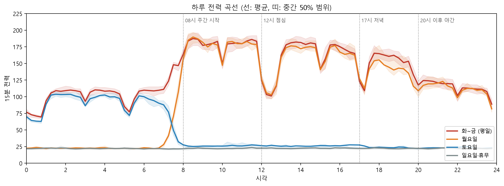

**그림 1. 요일별 15분 전력 곡선(화~금, 월, 토, 일·휴무)**

**주:** 실제 측정 구간의 평균 곡선이다. 휴게 시간의 하락과 월요일 08시의 일제 기동이 보인다.

전날의 가동 여부도 중요했다. 전날 가동한 평일은 야간 근무가 자정을 넘어 이어져 새벽 전력이 약 100kW였지만, 전날 휴무한 날은 약 20kW에 머물렀다. 또한 7월 31일~8월 8일의 하계 휴무와 8월 16일 대체공휴일의 정상 가동에서 보듯, 달력의 휴일과 실제 휴무가 일치하지 않았다. 따라서 가동 여부는 생산계획을 기준으로 구분하였다(부록 그림 A-1).

높은 부하는 평일 주간에 집중되었다. 178kW를 넘는 상위 10% 구간의 96%가 평일 08~16시에 있었으며, 가장 높은 네 구간 중 세 구간은 월요일에 발생했다. 이를 근거로 평일 **08:00~12:00와 13:00~16:00**를 위험 시간대로 정하고, 월요일 오전과 휴무 직후를 별도로 관리하도록 하였다(부록 그림 A-2·A-3).

### 1-4. 데이터 품질 진단

가이드북 방식의 품질 점수는 96.6점이었지만(부록 표 A-1), 빈칸이나 형식이 정상이어도 값의 내용에는 문제가 있을 수 있다. 날짜별 전력 곡선, 시간 순서, 파생 변수의 계산 관계를 추가로 확인한 결과는 표 4와 같다.

**표 4. 데이터 품질 진단: 가설과 판정**

| 가설 | 확인한 결과 | 판정 | 처리 |
|---|---|---|---|
| 일부 날의 전력 기록은 다른 날을 복사한 것이다 | 257일 중 160일(62%)이 다른 날과 완전히 같음. 1~6월에 집중(181일 중 158일, 87%), 8~9월은 0일 | O | 1~6월 제외, 7/1 이후만 사용 |
| 시간 열을 그대로 시각으로 쓸 수 있다 | 7/13·7/15는 시간 열에 그날 전력값이 작은 순서대로 들어 있음 | △ | 행 순서로 시각을 정하고 두 날 전력은 빈 값 |
| 전력 0은 공장이 멈춘 것이다 | 8/28 18시~8/29 10시 약 17시간 연속 0(9/8 15분 칸 2개 추가). 휴일에도 20~25kW는 쓰임 | X | 계측 중단으로 보고 빈 값 |
| 공장인원은 독립된 입력 변수다 | 공장인원 = 생산량 ÷ 그 시간 전력 합(3,511행 모두 일치) | X | 입력에서 제외 |
| 전기요금 열은 실제 계절별 단가다 | 값은 산업용(을) 고압A 선택Ⅰ 최대부하 단가와 같지만, 1~2월에 봄·가을 값, 3~5월·9월에 겨울 값이 붙음 | △ | 입력 제외, 계약 종류 확인에 활용(4장) |
| 계획 생산량이 많을수록 전력을 더 쓴다 | 하루 단위 상관 0.94는 가동일·휴무일 차이 때문. 화~금끼리는 −0.18 | X | 가동 여부만 사용 |
| 기온이 오르면 전력이 오른다 | 평일 주간 1℃당 약 1.7kW 높아 보이나 시기와 섞임. 예측 오차로 보면 95% 범위가 0을 포함(3장) | △ | 기본 모델에서 제외 |
| 08시대 기동 피크도 기본요금에 반영된다 | 2021년 시간대표로는 경부하라 무관, 현행 시간대표로는 중간부하라 반영 | △ | 관리 대상에 포함 |

**주:** 판정은 O(맞음), △(일부만 맞음), X(틀림)이다. 월별 반복 기록 일수는 부록 표 A-2, 생산량과 전력의 관계는 부록 그림 A-4, 기온과 전력의 관계는 부록 그림 A-5에 있다.

가장 큰 문제는 날짜가 다른데 하루의 15분 전력 96개가 모두 같은 날이 있다는 점이었다. 이런 날은 전체 257일 중 160일이었고, 1~6월에는 181일 중 158일이었다. 같은 전력 곡선에 서로 다른 날의 생산량과 날씨가 붙어 있으므로, 이 기간을 학습에 쓰면 가동 조건과 전력의 관계를 잘못 배우게 된다.

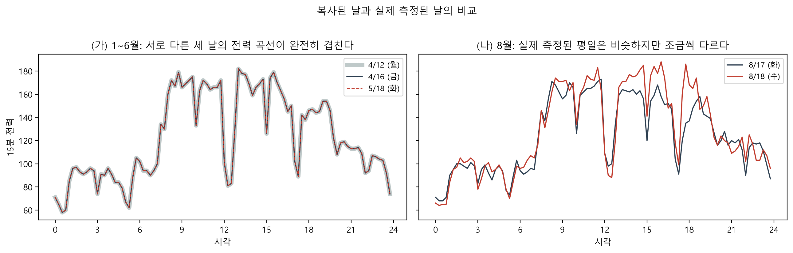

**그림 2. 다른 날과 전력 기록이 똑같은 날의 예**

**주:** (가) 1~6월의 서로 다른 세 날(4/12·4/16·5/18)의 15분 전력이 완전히 겹친다. (나) 실제 측정된 8월 평일 두 날은 비슷하지만 조금씩 다르다. 다른 진단 그림은 부록 그림 A-6~A-8에 있다.

실제로 학습에 사용하는 기간만 바꾸어 비교하자, 1~6월을 포함한 경우 같은 시험 기간의 오차가 7.60kW에서 13.52kW로 커졌다. 날짜를 무작위로 나누었을 때는 시험일의 61%가 학습 자료에 동일한 기록을 가지고 있어 독립적인 평가도 어려웠다. 이후 분석에서는 7월 1일 이후의 자료를 사용하고 과거에서 미래로 평가하는 방식을 채택하였다.

**표 5. 데이터 사용 방식별 성능 (MAE, kW)**

| 학습·평가 방식 | 기준 곡선 | LightGBM | 시험일 중 학습에 똑같은 날이 있는 비율 |
|---|---|---|---|
| 1~9월 전체 + 날짜 무작위 분할(20번 평균) | 16.98 | 17.13 | 61% |
| 1~9월 전체 + 시간순(8/9~9/14 평가) | 13.52 | 13.56 | 0% |
| 7/1 이후만 + 시간순(8/9~9/14 평가, 채택) | 7.60 | 7.78 | 0% |

**주:** 무작위 분할은 시험 날짜가 달라 아래 두 행과 오차를 직접 비교하지 않는다. 한 번에 나눈 결과라 2장의 5주 평가(7.32kW)와도 조금 다르다.

다른 이상도 함께 처리하였다. 7월 13일·15일에는 시간 열이 손상되었고, 8월 28일~29일의 연속 0kW는 계측 중단으로 판단하였다. 공장인원과 평균 열은 예측 대상인 전력으로부터 계산된 값이므로 입력에서 제외했다. 전기요금 열에는 계절 구분 오류가 있어 예측 입력으로 사용하지 않고 계약 종류를 추정하는 참고 자료로만 활용하였다.

### 1-5. 전처리와 분석 범위

진단 결과를 반영한 처리 과정은 표 6과 같다. 이상 전력값은 채워 넣지 않고 결측으로 남겼으며, 동일 기록인 7월 28일·30일은 성능 평가의 정답으로 사용하지 않았다.

**표 6. 전처리 내역**

| 순서 | 처리 | 이유 |
|---|---|---|
| 1 | 시각을 시간 열 대신 하루 안의 행 순서로 정함 | 7/13·7/15의 시간 열 손상(다른 날은 두 방법의 결과가 같음) |
| 2 | 7/1 이후만 사용 | 1~6월은 181일 중 87%가 반복 기록 |
| 3 | 1시간 1행을 15분 1행으로 펼침 | 요금이 15분 단위로 매겨짐 |
| 4 | 7/13·7/15의 전력과 전력 0 칸은 빈 값으로 둠 | 몇 시 값인지 모름, 계측 중단 |
| 5 | 7/28·7/30은 정답으로 쓰지 않음 | 두 날이 서로 똑같아 어느 쪽이 진짜인지 모름 |
| 6 | 평균·공장인원 열 제거 | 정답(전력)에서 계산된 값 |
| 7 | 하루 종류를 생산계획으로 정의(평일 가동, 토요일, 휴일 + 전날 가동 여부) | 쉬는 날이 공휴일 달력과 다름 |

분석 기간은 7월 1일~9월 14일의 76일(15분 구간 7,296개)이다. 시간 정보가 손상된 2일은 전력을 결측으로 두어 전력이 기록된 날은 74일이며, 여기서 계측 중단 구간과 서로 똑같은 2일(7월 28일·30일)을 빼고 정답으로 쓰는 구간은 6,838개이며, 이후 이를 '평가 대상 칸'이라 부른다. 생산량이 0으로 기재된 7월 13일·15일은 최대전력이 각각 190kW·202kW여서 평일 가동일로 분류를 바로잡았다. 하루 종류는 평일 가동, 토요일, 휴일로 나누고 전날 가동 여부를 더하였다(부록 표 A-3).

이후 예측에는 하루 종류, 전날 가동 여부, 시각, 최근 전력을 사용하였다. **생산계획의 가동 여부를 전날 알 수 있다는 조건**을 두었으며, 자료의 생산량이 실제 계획인지 실적 기록인지는 확인하지 못했다. 또한 1단계 기준을 넘는 구간은 시험 기간 가동일 구간의 4.5%에 불과하므로, 경보는 전체 정확도보다 피크를 잡는 비율과 경보의 적중 비율로 평가하였다.

## 제2장. AI 예측모델 개발 및 성능평가

### 2-1. 예측 목적과 시점

하루 앞 예측은 다음 날 작업 일정을 준비하는 데, 1시간 앞 예측은 당일 설비 기동과 피크 경보에 사용한다. 두 예측 모두 15분 전력을 대상으로 하되, 예측을 내는 시각과 사용할 수 있는 정보를 명확히 구분하였다.

**표 7. 두 가지 예측 문제**

| 항목 | 하루 앞 예측 (주 예측) | 1시간 앞 예측 (보조 예측) |
|---|---|---|
| 예측 시점 | 매일 자정 직전(전날 23:45 기록까지) | 매 정시(직전 15분 기록까지) |
| 예측 대상 | 다음 날 15분 전력 96칸 | 다음 1시간의 15분 전력 4칸 |
| 용도 | 작업 일정·설비 가동 시점 조정(계획) | 당일 피크 경보(대응) |
| 넘어야 할 기준 | 지난주 같은 시각 값 | 직전 15분 값 |
| 쓰는 정보 | 달력, 생산계획(하루 종류·가동 여부), 전날까지의 전력 | 달력, 생산계획, 직전 15분까지의 전력 |
| 쓰지 않는 정보 | 기온(내일 실제 값을 모름, 비교 실험만), 전기요금·인건비, 평균·공장인원 | 같음 |

입력은 예측 시점에 알 수 있는 정보로 제한하였다. 다음 날의 실제 기온처럼 아직 관측되지 않은 정보는 최종 모델에 넣지 않았으며, 기온의 효과를 살펴보는 별도 비교 실험에서만 사용하였다.

### 2-2. 평가 방법

평가는 하계 휴무가 끝난 8월 9일부터 9월 14일까지 5주, 37일을 대상으로 진행하였다. 한 주씩 미래를 시험하고, 매주 그 이전 기간의 자료만으로 모델을 학습하였다. 학습 기간은 첫 주 39일에서 마지막 주 67일로 늘어났다. 유효 평가 구간은 하루 앞 3,478개, 1시간 앞 3,476개였다(부록 표 A-4).

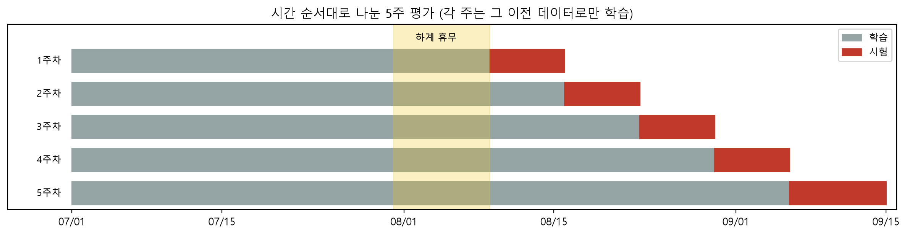

**그림 3. 시간 순서 평가 방법(5주)**

**주:** 각 시험 주는 그 앞 기간으로만 학습한다. 본 보고서에서 '1주차'는 첫 시험 주(8/9~8/15), '2~5주차'는 그 뒤 4주(8/16~9/14)를 말한다.

주 지표는 **평균 절대오차(MAE)**이다. 예측이 실제 전력과 평균적으로 몇 kW 차이 나는지를 보여준다. 큰 오차에 민감한 RMSE, 실제 전력의 합 대비 절대오차의 합인 상대오차, 하루 최대전력의 오차도 함께 확인하였다. 휴일·야간의 낮은 전력에서 비율이 과도하게 커지는 MAPE는 사용하지 않았다.

모델 간 차이는 시험 날짜를 2,000번 다시 뽑는 날짜 단위 부트스트랩으로 평가하였다. 오차 차이의 95% 범위가 0을 포함하면 개선이 명확하지 않은 것으로 해석하였다. 더 복잡한 후보는 평균 오차가 낮고 개선도 확인될 때 채택하며, 그렇지 않으면 단순하고 설명하기 쉬운 모델을 선택하였다. 예측 비교에 널리 쓰는 Diebold–Mariano 검정(날짜별 평균 절대오차 차이, 소표본 보정)도 함께 수행했으며, 17개 비교 모두 부트스트랩과 결론이 같았다(부록 표 A-5).

### 2-3. 비교 모델

비교는 지난주 같은 시각의 값과 직전 관측값을 사용하는 단순 기준에서 시작하였다. 여기에 최근 4주 같은 요일의 중앙값, 생산계획 기반 기준 곡선, 트리 모델(LightGBM), 선형 회귀, 칼만 필터, 통계 시계열 모델(MSTL, ARIMA), 딥러닝 모델(NHITS, TFT), 사전학습 모델(Chronos-2)과 모델 평균을 같은 5주 평가에 넣었다. 통계·딥러닝 모델은 부록 파이프라인(1시간 최대 예측)에서 쓴 구성을 따르되, 학습 자료와 평가 방식은 본 분석과 같게 맞추었다. LSTM은 이 CPU 환경에서 시험 한 주를 학습하는 데 40분 넘게 걸려 15분 비교에서 빼고, 부록 파이프라인의 결과로 대신하였다.

**기준 곡선**은 과거 전력을 하루 종류, 전날 가동 여부, 시각별로 평균한 곡선이다. 예를 들어 전날에도 가동한 평일의 11시에 평소 어느 정도의 전력을 쓰는지 설명할 수 있다. LightGBM은 입력 간 관계를 학습하는 트리 모델이며, 선형 회귀는 기준 곡선과 현재 전력의 차이를 반영해 가까운 미래를 보정한다.

Chronos-2는 다양한 시계열로 사전학습된 모델로, 이 공장의 자료로 추가 학습하지 않고 과거 전력과 가동 계획을 입력하였다. 에너지 분야 비교 결과를 참고해 후보로 선정했으며, CPU 환경에서 실행하였다(Apache-2.0 라이선스; arXiv 2510.15821, 2604.22328). 비교 모델의 실행 설정은 부록 C에 정리하였다.

**외부 자료 활용.** Chronos-2를 이 공장 자료만으로 추가 학습하면 74일의 자료에 과적합되기 쉽다. 15분 에너지 자료 54개를 비교한 연구에서도 자료별 LoRA 미세조정이 추가 학습 없는 경우보다 나빴고(54개 중 16개만 개선; arXiv 2604.22328), 부록 파이프라인에서 이 공장 자료로 미세조정한 Chronos-2(small, peft가 없어 전체 미세조정)도 추가 학습 없는 경우보다 낫지 않았다. 그래서 공장 전력의 일반적인 모양을 더 배우도록, 공개된 다른 공장의 15분 전력 자료로 LoRA 미세조정한 Chronos-2를 후보에 추가하였다. LoRA는 원래 가중치는 그대로 두고 일부 층에 작은 보정값만 학습하는 방법이다. 사용한 자료는 독일 산업체 50곳의 1년 부하(Braeuer, 2020, Zenodo, doi:10.5281/zenodo.3899018)와 한국 철강 공장 1곳의 1년 전력(UCI Machine Learning Repository, Steel Industry Energy Consumption)이며, 둘 다 CC BY 4.0으로 공개되어 있다. 두 자료는 Chronos-2 사전학습 목록에 없고 2016~2018년 자료라 시험 기간의 정보가 섞이지 않는다. 생산계획이 없는 외부 자료는 하루 평균 전력으로 가동일을 추정해 본 분석과 같은 입력 형식으로 만들었고, 학습을 멈출 단계는 시험 전 기간(7/19~7/30)의 1시간 앞 손실로 골랐다. CPU 제약으로 240단계 × 배치 8(개발사 기본 설정의 1% 미만)만 학습했고, 학습한 값은 전체 가중치의 1.00%(120,684,576개 중 1,206,912개)였다.

### 2-4. 모델 비교 결과

하루 앞 예측의 최종 모델은 생산계획 기반 기준 곡선으로 **MAE 7.32kW**, 1시간 앞 최종 모델은 선형 회귀와 Chronos-2의 평균으로 **MAE 5.85kW**를 기록하였다. 후보별 결과와 차이의 범위는 표 8 및 그림 4와 같다.

**왜 단순한 구조가 이겼나.** 이 공장의 전력은 '오늘 가동하는가'와 '몇 시인가'로 대부분 정해진다. 3-4의 SHAP 분석에서도 하루 종류(35.5kW)와 시각(20.2kW)의 몫이 다른 변수의 2~4배였다. 기준 곡선은 이 구조를 과거 평균으로 직접 담은 모델이다. 학습 자료는 시험 주마다 39~67일뿐이어서, 같은 구조를 데이터로 다시 배우는 복잡한 모델은 새 정보 없이 추정 오차만 늘어난다. 기준 곡선과 같은 정보만 준 LightGBM은 7.47kW로 거의 같았다. 과거 기록만 보는 MSTL(11.64kW)은 하계 휴무 직후 주에 직전 기록을 따라가다 크게 틀렸고, 시각·하루 종류를 입력으로 받은 딥러닝(TFT 12.18kW, NHITS 13.96kW)도 크게 뒤졌다. 하루 앞에서 기준 곡선에 가까웠던 후보는 모두 기준 곡선을 입력으로 쓰거나(ARIMA, 7.71kW) 기준 곡선과 섞은 경우(7.10·7.21kW)였다. 반대로 1시간 앞에서는 직전 전력이라는 새 정보가 생기므로, 이를 학습해 쓰는 선형 회귀와 Chronos-2가 기준 곡선보다 20% 정확했다. 성능을 가른 것은 모델의 복잡도보다 **예측 시점에 어떤 정보가 있느냐**였다.

**표 8. 모델 비교 요약 (5주 시험 전체)**

| 모델 | MAE (kW) | RMSE (kW) | 상대오차 | 최종 대비 MAE 차이 (95% 범위) | 판정 |
|---|---|---|---|---|---|
| 하루 앞: 지난주 같은 시각 | 23.68 | 46.86 | 22.4% | 16.24 (5.31~28.71) | 최종이 더 정확 |
| 하루 앞: 딥러닝 TFT(+가동 계획, 줄인 설정) | 12.18 | 19.65 | 11.7% | 4.86 (3.97~5.74) | 최종이 더 정확 |
| 하루 앞: LightGBM(달력+계획) | 8.94 | 12.95 | 8.6% | 1.64 (1.10~2.26) | 최종이 더 정확 |
| 하루 앞: ARIMA(+기준 곡선) | 7.71 | 11.36 | 7.4% | 0.39 (−0.10~0.92) | 우연 범위 |
| 하루 앞: 기준 곡선 + ARIMA(+기준 곡선) 평균 | 7.21 | 10.88 | 6.9% | −0.11 (−0.50~0.23) | 우연 범위 |
| 하루 앞: Chronos-2(+가동 계획) | 7.54 | 11.32 | 7.2% | 0.22 (−0.48~1.05) | 우연 범위 |
| 하루 앞: 기준 곡선 + Chronos-2 평균 | 7.10 | 10.72 | 6.8% | −0.22 (−0.59~0.20) | 우연 범위 |
| 하루 앞: 기준 곡선 (최종) | 7.32 | 10.98 | 7.0% | – | 최종 모델 |
| 1시간 앞: 직전 값 그대로 | 14.48 | 23.59 | 13.9% | – | 단순 기준 |
| 1시간 앞: 딥러닝 NHITS(+가동 계획, 줄인 설정) | 9.59 | 14.58 | 9.2% | 3.75 (2.71~4.93) | 최종이 더 정확 |
| 1시간 앞: LightGBM | 6.52 | 9.56 | 6.3% | 0.67 (0.39~1.00) | 최종이 더 정확 |
| 1시간 앞: 칼만 필터 보정 | 6.36 | 9.51 | 6.1% | 0.51 (0.24~0.80) | 최종이 더 정확 |
| 1시간 앞: 기준 곡선 + 현재 편차 | 6.35 | 9.51 | 6.1% | 0.50 (0.26~0.78) | 최종이 더 정확 |
| 1시간 앞: 선형 회귀 | 6.26 | 9.12 | 6.0% | 0.42 (0.21~0.62) | 최종이 더 정확 |
| 1시간 앞: Chronos-2 미세조정(다른 공장 자료) | 6.10 | 9.27 | 5.9% | 0.25 (0.08~0.43) | 최종이 더 정확 |
| 1시간 앞: ARIMA(+기준 곡선) | 6.07 | 8.93 | 5.8% | 0.22 (0.01~0.39) | 최종이 더 정확 |
| 1시간 앞: Chronos-2(+가동 계획) | 6.06 | 9.27 | 5.8% | 0.22 (0.05~0.41) | 최종이 더 정확 |
| 1시간 앞: 선형 회귀 + Chronos-2 평균 (최종) | 5.85 | 8.53 | 5.6% | – | 최종 모델 |

**주:** 차이 = 후보 − 최종 모델(같은 날끼리 비교)이며, 음수면 후보가 더 정확하다. 하루 앞의 차이는 모든 비교 모델이 예측한 공통 3,406칸(지난주 같은 시각은 첫 72칸이 없음)으로 계산해, MAE의 단순 차와 조금 다르다. 나머지 후보는 그림 4와 부록 표 A-6~A-9에 있다. 통계·딥러닝·미세조정 후보는 각 후보와 최종 모델이 모두 예측한 칸으로 계산했으며, 전체 결과와 Diebold–Mariano 검정은 부록 표 A-10에 있다.

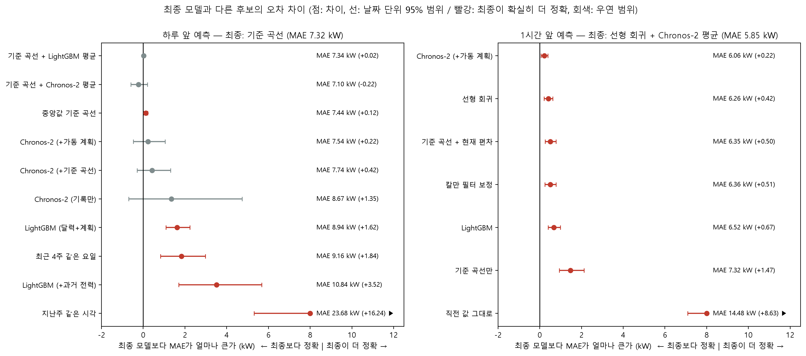

**그림 4. 모든 후보의 최종 모델 대비 MAE 차이와 95% 범위**

**주:** 빨간 점은 최종 모델이 확실히 더 정확한 후보, 회색 점은 차이가 우연 범위인 후보이다. 두 모델씩 둘 다 예측한 칸으로 계산해 표 8과 소수점 자리가 조금 다를 수 있다.

하루 앞 기준 곡선은 5주 모두 MAE 6.7~9.1kW로 안정적이었다. 지난주 같은 시각을 사용하는 방법보다 평균 오차가 69% 낮았지만, 하계 휴무 직후인 첫 주의 영향이 컸다. 첫 주를 제외하면 감소율은 19%였다(9.40 → 7.63kW). 평소 운영에서의 개선 폭은 19% 정도로 보는 것이 맞다(그림 5, 부록 그림 A-9).

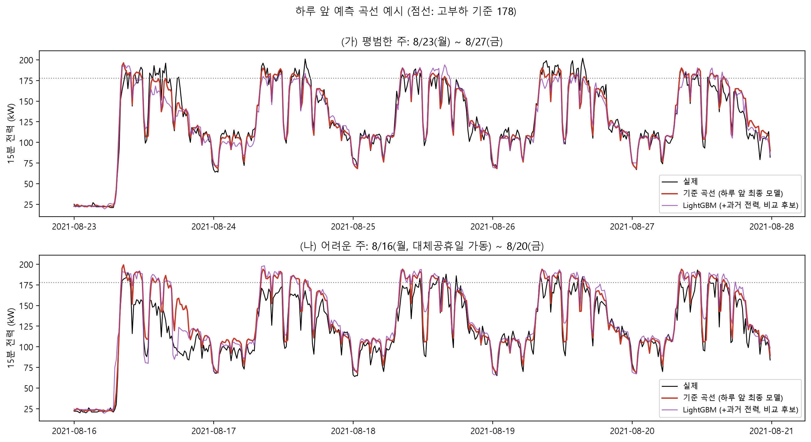

**그림 5. 하루 앞 예측 곡선(평범한 주와 어려운 주)**

**주:** (가) 평범한 주에는 기준 곡선이 가동 시작·휴게·교대에 따른 전력 변화를 따라간다. (나) 8/16 대체공휴일 가동일은 오후부터 실제 전력이 크게 낮아 기준 곡선이 높게 예측하였다. 점선은 고부하 기준 178kW이다.

기준 곡선과 Chronos-2를 평균한 후보는 MAE 7.10kW로 가장 낮았으나, 기준 곡선과의 차이는 95% 범위에 0을 포함했다. 일부 주에는 오차가 커졌고 하루 최대전력의 오차도 개선되지 않아 최종 모델로 채택하지 않았다. Chronos-2 단독은 가동 계획을 넣으면 7.54kW, 넣지 않으면 8.67kW로, 사전학습 모델에서도 가동 계획의 중요성이 나타났다.

1시간 앞에서는 직전 값을 그대로 쓰는 방법의 오차가 14.48kW였다. 가동 시작, 점심, 재가동, 저녁 휴게처럼 전력이 크게 변하는 시점이 정시에 모여 있기 때문이다. 선형 회귀는 ‘대상 시각의 기준 곡선 + 0.53 × 현재 편차’의 구조를 학습하였다. 현재 전력이 평소보다 10kW 높으면 가까운 미래에도 약 5kW 높게 보는 방식이다. 여기에 Chronos-2를 반반 결합하자 선형 회귀 단독 대비 오차가 약 7% 줄었고, 모든 예측 거리에서 개선되었다(부록 표 A-9·A-11).

추가로 비교한 통계·딥러닝·미세조정 후보도 최종 모델을 넘지 못했다. 하루 앞에서 가장 가까운 후보는 기준 곡선과 ARIMA(+기준 곡선)의 평균(7.21kW)이었지만 차이가 우연 범위였고(95% 범위 −0.50~0.23kW), 고부하 구간 MAE가 7.99kW에서 8.19kW로 나빠져 채택하지 않았다. 다른 공장 자료로 미세조정한 Chronos-2의 1시간 앞 MAE는 6.10kW로 미세조정 전(6.06kW)과 비슷했고, 고부하 구간은 9.37kW에서 9.86kW로 오히려 나빠졌다. 짧게 학습한 설정에서는 개선이 없었다는 뜻이다. NHITS·TFT는 CPU 시간 때문에 학습 단계와 입력 길이를 줄인 결과로, 1시간 앞에서 기준 곡선만 쓸 때(7.32kW)보다도 나빴던 점(9.59·11.75kW)은 학습 부족의 영향이 클 수 있다. 딥러닝 계열 전체에 대한 결론으로 보지는 않는다. 추가 후보 20개 비교 중 19개는 부트스트랩과 Diebold–Mariano 검정의 결론이 같았고, 기준 곡선 + MSTL 평균만 부트스트랩으로는 차이가 있었지만 DM 검정은 p = 0.055였다(부록 표 A-10).

과제는 예측 단위를 정하지 않았으며("향후 지정된 시간구간"), 본 분석은 요금이 15분 최대로 정해지므로 15분을 주 단위로 삼았다. 같은 예측을 1시간 최대(15분 값 4개 중 최대)로 바꾸어 보면 MAE는 하루 앞 7.06kW, 1시간 앞 5.85kW로 15분 기준과 비슷했지만 평균 0.8~2.3kW 낮게 예측했다. 15분 예측은 평탄해서 네 구간 중 튀는 값을 따라가지 못하기 때문이며, 3장의 경보에 여유값이 필요했던 이유와 같다(부록 표 A-12).

1시간 최대를 직접 예측 대상으로 둔 모델도 같은 5주·같은 발행 시각에서 비교하였다. 시간 최대를 직접 예측한 Chronos-2의 1시간 앞 MAE는 5.78kW로 15분 최종 모델의 4칸 최대(5.85kW)와 차이가 우연 범위였다. 그러나 실제 피크가 난 시간의 MAE는 7.68kW 대 9.95kW로 시간 최대 모델이 유의하게 작았다(차이의 95% 범위 −3.36~−1.38kW). 직접 예측하면 평탄화에 따른 과소예측이 줄어든다는 뜻이며, 이 모델은 시간 단위 경보에 함께 쓴다(3-3, 02-4 노트북). 1~9월 자료로 트리·딥러닝·통계 모델 15종 이상을 비교한 별도 파이프라인은 검증 구간 일부(6월~7월 초)에 반복 기록이 섞여 있어, 반복 기록이 없는 시험 기간(9/1~9/14) 결과만 부록에 인용하였다(부록 표 A-13).

### 2-5. 입력 정보의 효과

하루 앞 예측에 사용하는 정보를 단계적으로 바꾸어, 무엇이 성능에 기여하는지 확인하였다.

**표 9. 하루 앞 예측의 입력 정보 실험**

| 실험 | MAE (kW) | 고부하 구간 MAE (kW) | 하루 최대 전력 오차 (kW) |
|---|---|---|---|
| (가) 달력만으로 만든 기준 곡선(일요일·공휴일 = 쉬는 날) | 14.47 | 32.62 | 26.25 |
| (나) 생산계획 기반 기준 곡선 (최종) | 7.32 | 7.99 | 7.23 |
| (다) LightGBM: 기준 곡선과 같은 정보 | 7.47 | 8.08 | 7.85 |
| (라) LightGBM: + 시간별 계획 생산량 | 8.41 | 9.18 | 8.42 |
| (마) LightGBM: + 하루 계획 생산량 | 9.19 | 9.94 | 10.63 |
| (바) LightGBM: + 요일·시간별·하루 계획 생산량 | 9.37 | 10.74 | 9.54 |
| (사) 기준 곡선 + 기온 보정(예보가 정확하다고 가정) | 7.23 | 8.87 | 7.64 |

**주:** 고부하 구간은 실제 전력이 178kW를 넘는 상위 10% 칸이다.

가장 큰 효과는 **가동 여부를 생산계획으로 구분한 것**이었다. 달력만 사용하면 하계 휴무를 평일로 판단하여 MAE가 14.47kW였지만, 생산계획을 사용하면 7.32kW로 약 49% 낮아졌다.

반면 생산량의 크기를 추가한 후보는 MAE가 8.41~9.37kW로 커졌다. 가동일 사이에서 생산량과 전력의 관계가 약했던 점과 일관된 결과이며, 이번 자료에서는 생산량의 크기를 최종 입력으로 채택할 근거를 얻지 못했다. 실제 기온을 정확히 안다고 가정한 보정도 평균 오차를 소폭 낮추는 데 그쳤고, 고부하 구간의 오차는 커졌다.

### 2-6. 최종 모델과 적용 범위

**표 10. 최종 모델**

| 항목 | 하루 앞 예측 | 1시간 앞 예측 |
|---|---|---|
| 최종 모델 | 생산계획 기반 기준 곡선 | 선형 회귀 + Chronos-2 평균 |
| MAE / RMSE / 상대오차 | 7.32kW / 10.98kW / 7.0% | 5.85kW / 8.53kW / 5.6% |
| 가장 단순한 방법 대비 | 23.68 → 7.32kW, 69% 감소(휴무 직후 주 제외 시 19%) | 14.48 → 5.85kW, 60% 감소 |
| 기준 곡선만 쓸 때 대비 | – | 7.32 → 5.85kW, 20% 감소 |
| 하루 최대 전력 오차 | 7.23kW | – |

하루 앞에는 공장의 운영 패턴을 설명할 수 있는 기준 곡선을 선택하였다. 1시간 앞에는 평균 오차의 개선이 확인된 선형 회귀와 Chronos-2의 평균을 선택하였다. 두 모델의 오차 상관은 0.73이었지만, 약 21%의 구간에서는 서로 반대 방향으로 예측해 결합 시 오차가 상쇄되었다(부록 그림 A-10). 그림 6은 입력에서 현장 활용까지 최종 모델의 구조를 정리한 것이다.

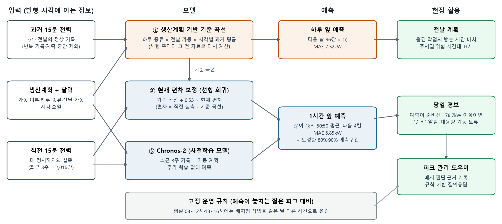

**그림 6. 최종 예측·경보 구조**

**주:** 하루 앞 예측은 ①, 1시간 앞 예측은 ②와 ③의 평균이다. 예측이 놓치는 짧은 피크는 고정 운영 규칙이 맡는다(4장).

최종 결합 모델은 5주 중 4주, 37일 중 29일에서 선형 회귀보다 정확했다. 결합 비율도 점검하였다. Chronos-2 비중 40~60%에서 MAE는 5.84~5.88kW로 큰 차이가 없었으며, 이전 주 결과로 비중을 선택하면 5.95kW로 오히려 커졌다. 그래서 50:50 고정 평균을 유지하였다. 후보 비교와 최종 선정을 같은 시험 기간에서 했으므로, 새 기간에서는 성능이 이보다 조금 낮을 수 있다. 그 크기를 재기 위해 3-5의 선정 규칙을 매주 그 앞 주까지의 결과에만 적용해 다시 고르고, 그렇게 고른 모델의 2~5주차 성능을 보았다. 하루 앞은 7.72kW, 1시간 앞은 5.87kW로, 최종 모델의 같은 기간 MAE(7.63·5.72kW)보다 각각 0.09·0.15kW 컸다. 이 차이가 선택 편향의 크기이며, 새 기간의 성능은 이 정도로 보는 것이 맞다. 1시간 앞에서는 고르는 과정 자체가 이득이었다. 앞 주로 다시 고른 결과(5.87kW)도 선형 회귀만 쓸 때(6.26kW)보다 0.39kW 작았다(95% 범위 −0.59~−0.20kW). 1주차만 보고 한 번 고르면 하루 앞 7.51kW, 1시간 앞 6.02kW였다(부록 표 A-14).

## 제3장. 영향요인 및 오류분석

### 3-1. 시험 기간의 피크

시험 기간의 최대전력은 8월 11일 08:30의 218kW로, 학습 기간의 최대인 222kW를 넘은 사례는 없었다. 189kW 주의 기준을 넘은 15분 구간은 116개였으며, 연속된 구간을 하나의 사건으로 묶으면 68회였다. 200kW를 넘은 구간은 18개, 사건은 12회였다(부록 표 A-15).

요금 시간대에 따라서도 관리 대상이 달라진다. 2021년 시간대표에서 경부하였던 08시대의 기동 피크는 현행 시간대표에서는 중간부하로 요금에 반영되며, 이 기준으로 시험 기간 1단계 초과 115개 구간 중 25개가 08시대였다. 어떤 피크가 요금에 들어가는지는 계약과 시간대표에 따라 다르므로, 도입 전에 실제 계약의 시간대표를 확인한다(부록 표 A-16).

### 3-2. 오차가 커지는 조건

예측 오차는 평일 주간과 평소와 다른 운영일에 집중되었다. 야간과 휴일의 오차는 상대적으로 작았고, 최근 전력을 반영하는 1시간 앞 예측이 평일 주간과 월요일의 오차를 줄였다.

**표 11. 조건별 예측 오차 (kW)**

| 조건 | 칸 수 | 하루 앞 MAE | 하루 앞 평균 오차 | 1시간 앞 MAE | 1시간 앞 평균 오차 |
|---|---|---|---|---|---|
| 전체 | 3,478 | 7.32 | +1.30 | 5.85 | +0.43 |
| 휴일(기본 전력) | 434 | 1.38 | +0.40 | 1.32 | +0.53 |
| 토요일 | 454 | 5.22 | −1.56 | 3.84 | −0.05 |
| 가동일 야간(20~07시) | 1,296 | 5.85 | −0.21 | 5.03 | −0.26 |
| 가동일 주간(08~19시) | 1,294 | 11.52 | +4.12 | 8.88 | +1.25 |
| 월요일 등 전날 휴일인 가동일 | 576 | 10.09 | +3.32 | 7.35 | +0.69 |
| 1단계 이상 피크 칸 | 116 | 11.40 | −11.20 | 10.60 | −10.32 |

**주:** 평균 오차가 +이면 예측이 실제보다 높다. 칸 수는 하루 앞 기준이다.

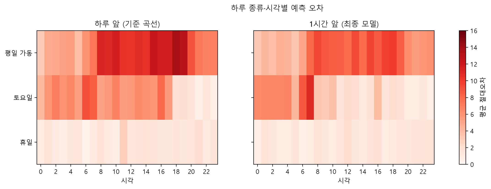

**그림 7. 하루 종류·시각별 예측 오차(왼쪽 하루 앞, 오른쪽 1시간 앞)**

**주:** 평일 08~19시가 가장 진하고, 1시간 앞 예측이 이 구간의 오차를 고르게 줄였다.

실제 전력이 189kW를 넘은 116개 구간에서 예측은 평균 약 11kW 낮았다(하루 앞 −11.20kW, 1시간 앞 −10.32kW). 실제값이 높은 구간만 고르면 우연히 높게 나온 구간이 섞여 이런 음의 오차가 생기기 쉬우므로, 예측값으로 나눈 결과도 확인하였다. 1시간 앞 예측이 189kW 이상인 54개 구간에서는 예측 평균 193.0kW, 실제 평균 188.5kW로 오히려 높게 예측하였다. 예측이 피크를 일관되게 낮게 보지는 않지만 실제 피크가 난 순간에는 낮게 예측하는 경향이 있으므로, 경보는 1단계보다 10kW 낮은 준비선에서 울리도록 하였다(부록 표 A-17).

특히 8월 16일 대체공휴일 가동, 8월 17일의 낮은 가동 강도, 하계 휴무 직후인 8월 9일, 평소와 달랐던 토요일 8월 28일의 오차가 컸다(부록 표 A-18). 그래서 주의일은 오차를 보고 나중에 정하지 않고, 월요일·휴무 직후처럼 미리 알 수 있는 운영 조건으로 정했다.

### 3-3. 1시간 앞 경보와 예측구간

피크를 놓치면 기본요금에 영향을 줄 수 있지만, 잘못 울린 경보에 매번 대응하면 작업 지연이 늘어난다. 경보는 실제 피크 중 얼마나 잡았는지를 나타내는 **재현율**과, 울린 경보 중 실제 피크가 얼마나 있었는지를 나타내는 **정밀도**를 함께 평가하였다. F1은 두 지표의 균형을, AP는 여러 문턱에서의 정밀도·재현율 관계를 요약한다.

첫 시험 주에서 재현율 90% 이상을 확보하는 최소 여유값 10kW를 정하였다. 이후에는 189kW 주의 기준보다 낮은 약 179kW를 준비선으로 유지하고, 2~5주차에서 성능을 평가하였다. 예측된 15분 구간이 준비선을 넘으면 경보 대상으로 표시하되, 담당자에게는 같은 발행 시각의 네 구간을 묶어 정시당 최대 한 번 알리도록 하였다.

**표 12. 1시간 앞 경보 성능 비교 (2~5주차, 1단계 피크 칸 60개)**

| 방법 | 재현율 (95% 범위) | 정밀도 (95% 범위) | F1 / PR-AUC | 가동일 하루 경보 칸 | 재현율 80%·90%일 때 하루 경보 칸 |
|---|---|---|---|---|---|
| 최종 모델, 여유값 10 | 0.77 (0.58~0.87) | 0.19 (0.09~0.28) | 0.30 / 0.19 | 11.3 | 12.7 / 16.7 |
| 최종 모델, 여유값 0 | 0.03 (0.00~0.06) | 0.15 (0.00~0.38) | 0.05 / – | 0.6 | – |
| 선형 회귀, 여유값 10 | 0.82 (0.64~0.91) | 0.17 (0.08~0.25) | 0.28 / – | 13.5 | 13.5 / 19.5 |
| Chronos-2, 여유값 10 | 0.57 (0.28~0.75) | 0.21 (0.09~0.31) | 0.30 / – | 7.5 | 13.9 / 15.5 |
| 기준 곡선만, 여유값 10 | 0.80 (0.68~0.88) | 0.11 (0.06~0.18) | 0.20 / – | 19.3 | 19.3 / 22.3 |
| 달력 규칙: 위험 시간대 전부 경보 | 0.98 (0.95~1.00) | 0.10 (0.05~0.15) | 0.17 / – | 28.0 | – |
| 과거 초과율 규칙(재현율을 모델에 맞춤) | 0.77 (0.64~0.88) | 0.10 (0.05~0.17) | 0.18 / 0.10 | 20.0 | – |

**주:** 95% 범위는 날짜 단위 부트스트랩이다. 과거 초과율 규칙은 시험 기간을 보고 재현율을 모델과 같게 맞춘 것이라 규칙 쪽에 유리한 비교이다.

최종 경보의 재현율은 0.77, 정밀도는 0.19였다. 이 보고서의 경보 수치는 따로 적지 않으면 15분 칸 단위이다. 같은 경보를 1시간 단위(피크가 있었던 시간 42개)로 세면 재현율 0.83, 정밀도 0.37이고, 시간 최대를 직접 예측한 Chronos-2로 경보하면 재현율 0.98, 정밀도 0.33이었다. 두 방법의 F1 차이는 우연 범위였으므로, 피크를 하나도 놓치지 않는 쪽을 원하면 후자를 '재현율 우선 경보'로 쓸 수 있다(02-4 노트북). 같은 재현율의 과거 초과율 규칙과 비교하면 하루 경보 구간은 20.0개에서 11.3개로 약 44% 감소했다. 여기서 경보 수는 **경보가 표시된 15분 구간 수**이고, 같은 시각의 네 구간을 묶어 담당자가 받는 알림은 하루 4.3회이다(4-6). 비교 규칙은 시험 기간을 보고 문턱을 맞췄으므로 규칙 쪽에 유리한 비교였다.

2~5주차의 피크 사건 39회 중 시작 구간을 사전에 포착한 사건은 28회(72%)였고, 21회는 적어도 45분 전에 알렸다. 놓친 피크는 11시와 14~15시의 짧은 상승에, 오경보는 기동 직후인 08시와 13시에 많았다. 여유값을 정한 첫 주에는 재현율이 0.90이었지만 이후 4주에는 0.77로 낮아졌다(부록 그림 A-11·A-12). 정밀도 0.19는 경보 다섯 번 중 한 번꼴로 실제 피크였다는 뜻이다. 그래서 경보는 새 부하를 더하기 전에 확인하는 신호로 쓴다. 그림 8은 맞힌 경보, 놓친 피크, 헛경보가 모두 나타난 하루의 예이다.

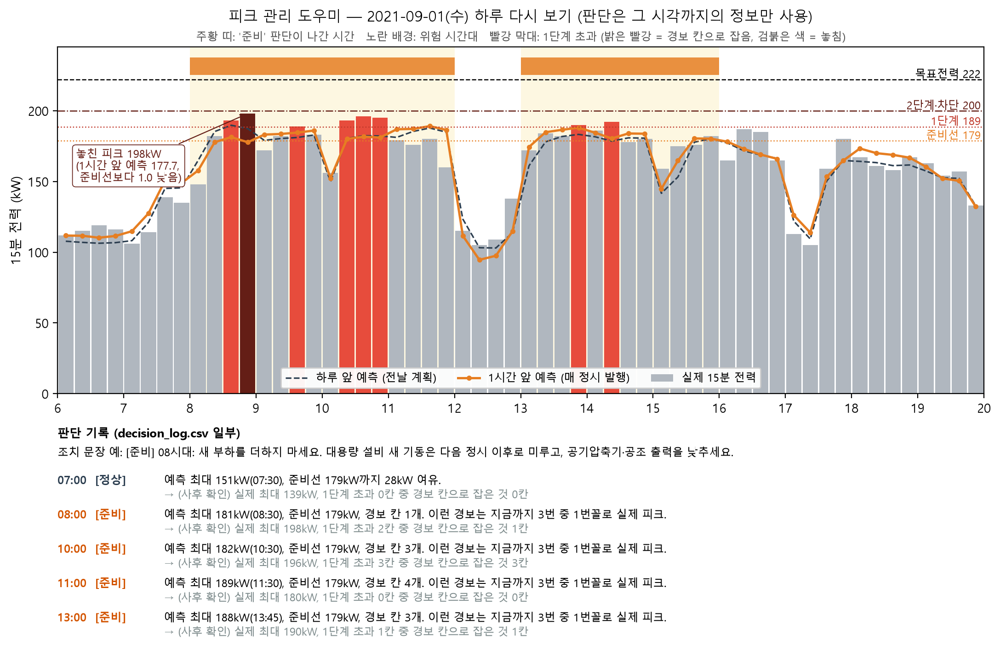

**그림 8. 1시간 앞 경보의 하루 예시(9/01)**

**주:** 10:15~10:45의 피크는 미리 잡았고, 08:45의 198kW는 1시간 앞 예측(177.7kW)이 준비선(178.7kW)보다 1.0kW 낮아 놓쳤으며, 11시대에는 헛경보가 났다. 아래는 같은 날의 판단 기록이다.

하루 앞 예측은 1단계를 넘는 날을 구분하는 성능이 낮았다(AUC 0.42). 시험 기간 가동일 27일 중 20일이 기준을 넘어 일별 구분 자체도 어려웠다. 따라서 하루 앞 예측은 작업 배치에, 1시간 앞 예측은 당일 대응에 사용하였다(부록 표 A-19·A-20, 부록 그림 A-13).

예측값과 함께 예측구간도 제공하였다. Chronos-2의 예측구간을 과거 오차로 보정하자, 15분 구간 하나하나를 기준으로 80% 구간 안에 실제값이 들어오는 비율이 0.743에서 0.796으로 높아졌고 구간 폭은 17.2kW에서 18.9kW로 넓어졌다. 90% 구간의 포함률도 0.868에서 0.901로 목표에 가까워졌다.

**표 13. 1시간 앞 예측구간 (시험 5주, 3,476칸)**

| 방법 | 80% 구간 적중률 (95% 범위) | 80% 폭 | 90% 구간 적중률 | 시험 주별 80% 적중률 |
|---|---|---|---|---|
| Chronos-2 분위수 그대로 | 0.743 (0.717~0.765) | 17.2kW | 0.868 | 0.73~0.75 |
| Chronos-2 + conformal 보정 (채택) | 0.796 (0.776~0.813) | 18.9kW | 0.901 | 0.78~0.81 |

**주:** 보정에 쓰는 오차는 각 시험 주 이전 기간에서만 가져왔다. 다른 보정 방법과의 비교는 부록 표 A-21에 있다.

보정한 구간으로 계산한 초과 확률로 경보해도 경보 구간 수는 여유값 규칙과 비슷하였다(재현율 0.77에서 하루 11.9개 대 11.2개, 0.90에서 15.3개 대 16.3개). 그래서 운영에는 단순한 준비선 방식을 유지하고, 예측구간은 현장 안내에 활용한다(부록 표 A-21·A-22, 부록 그림 A-14).

피크가 드문 문제에서 흔히 쓰는 확률 분류기도 비교하였다. 발행 시각에 알 수 있는 정보(대상 구간의 기준 곡선, 직전 실측, 편차, 시각, 하루 종류, 전날 가동)로 1단계 초과 확률을 직접 학습한 LightGBM(클래스 가중)은 PR-AUC 0.200으로 회귀 예측값(0.185)과 비슷했고, 같은 재현율 0.77에서 하루 경보 구간은 12.7개로 오히려 많았다. 1단계 초과는 전체의 2.1%로 드물고 그 수준도 평일 주간 전력과 가까워, 회귀 예측값이 이미 피크 여부를 잘 담고 있었다. 그래서 현재 방식을 유지하였다(부록 표 A-23). 시간 단위로 따로 학습한 분류기와 스태킹 결합도 F1이 회귀 예측 경보보다 유의하게 낮았다(02-4 노트북).

### 3-4. 영향요인의 해석

변수를 하나씩 보는 대신 조건이 겹칠 때의 효과를 보기 위해, 설명용 LightGBM으로 15분 전력과 1단계 초과 여부를 각각 설명하고 SHAP 값으로 변수별 몫과 변수 쌍의 상호작용 몫을 나누었다. SHAP은 한 구간의 예측값을 평균과 변수별 몫으로 나눈 값이며, 상호작용 값은 두 변수가 함께 있을 때만 생기는 몫이다. 입력은 하루 종류, 전날 가동, 시각, 요일, 기온, 습도이다.

전력 수준에서는 하루 종류(평균 35.5kW)와 시각(20.2kW)의 몫이 가장 컸고, 가장 큰 상호작용도 **하루 종류 × 시각(14.3kW)**이었다. 가동일과 휴일의 전력 차이가 시각마다 다르다는 뜻이다. 기준 곡선을 하루 종류와 시각별 평균으로 만든 것도 이 때문이다. 전날 가동 × 시각의 상호작용은 전날 쉰 평일에 새벽 약 −22kW, 08시 이후 주간 약 +8~9kW로 나타났다(그림 9). 쉬고 난 뒤 설비를 한꺼번에 켜는 월요일 오전에 피크가 몰린 현상(1-3)이 이 상호작용으로 설명된다. 1단계 초과에서도 시각과 하루 종류의 몫, 그리고 그 상호작용이 가장 컸다(부록 표 A-24·A-25).

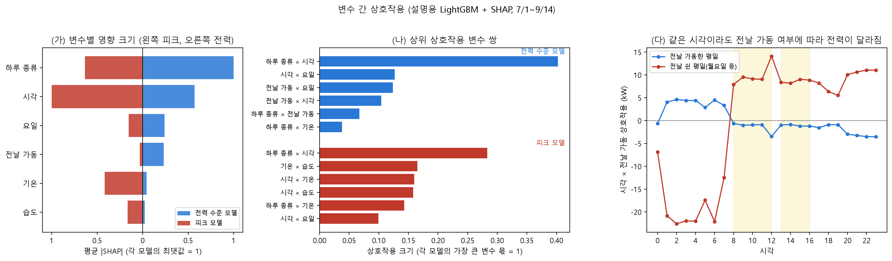

**그림 9. 변수 간 상호작용(설명용 LightGBM + SHAP, 7/1~9/14)**

**주:** (가) 변수별 영향 크기(왼쪽 피크 모델, 오른쪽 전력 수준 모델, 각 모델의 최댓값 = 1). (나) 상위 상호작용 변수 쌍. (다) 시각 × 전날 가동 상호작용: 전날 쉰 평일은 새벽에 낮고 위험 시간대(노란 띠)에 높다.

생산량은 설명 변수에서 제외하였다. 시간별 생산량은 그 시간의 가동 여부를 거의 그대로 담아 시각과 하루 종류의 몫을 대신 가져갔고, 하루 생산량은 날마다 값이 달라 모델이 날짜를 구분하는 식별자로 쓰였다. 실제로 평일 가동일 45일에서 하루 생산량과 하루 최대전력의 상관은 0.00이었다. 자료 전체에서 전력과 생산량의 하루 단위 상관은 0.94로 높았지만, 화~금 가동일끼리 비교하면 −0.18이었다. 전력의 큰 차이는 생산량의 크기보다 가동일과 휴무일의 구분에서 나타났다.

기온 역시 전력과 함께 높아지는 것처럼 보였으나 시기의 영향이 섞여 있었다. 예측 후 남은 오차와의 관계는 1℃당 0.68kW였고, 주차를 통제하면 0.13kW로 작아졌다. 두 추정치 모두 95% 범위가 0을 포함했다. 이번 자료로는 기온만의 효과를 확인하지 못했다. SHAP에서 기온이 들어간 상호작용(기온 × 습도, 시각 × 기온)도 같은 이유로 시기의 영향일 수 있다. 모델에서 제외한 다른 변수와 남은 오차의 상관도 절댓값 0.06 이하였다(부록 표 A-26·A-27, 부록 그림 A-15·A-16).

### 3-5. 현장에서 주의할 조건

**표 14. 잘 작동하는 조건과 실패하는 조건**

| 구분 | 잘 작동하는 조건 | 실패하는 조건 |
|---|---|---|
| 하루 종류·시각 | 휴일(MAE 1.4kW 안팎), 가동일 야간(5.85 / 5.03kW) | 가동일 주간(11.52 / 8.88kW), 월요일 등 전날 쉰 가동일(10.09 / 7.35kW) |
| 날 | 평소대로 운영한 평일 | 8/16 대체공휴일 가동, 8/09 휴무 직후, 8/28 토요일 |
| 시기 | 확률 보정 자료가 쌓인 3주차 이후 | 운영 수준이 바뀐 기간(초과 비율 9.0% → 4.5%): 하루 앞 예측·확률이 높게 나옴 |
| 하루 앞 경보 | 위험 시간대 안내(08·11·14시 부근) | '넘는 날' 고르기(AUC 0.42), 정확한 피크 시각(1시간 이내 41%) |
| 1시간 앞 경보(경향) | 30분 이상 이어진 피크(놓친 비율 0.17), 오후(0.17) | 15분짜리 짧은 피크(0.32), 오전(0.28), 월요일 등(0.36) |
| 헛경보 | – | 거의 모든 조건에서 헛경보 비율 0.8 안팎, 08시·13시에 가장 많음 |

**주:** MAE는 '하루 앞 / 1시간 앞'이다. 1시간 앞 경보의 조건별 비율은 조건마다 피크 칸이 11~49개라 95% 범위가 겹치므로 경향으로만 본다(부록 표 A-28).

예측을 믿을 수 있는 정도는 조건마다 다르다. 평일 주간, 월요일, 휴무 직후에는 고정 운영 규칙과 담당자의 확인을 강화하고, 1시간 앞 경보가 꺼져 있어도 큰 작업을 더할 때는 부하를 따로 확인한다.

## 제4장. 현장 활용방안

### 4-1. 운영안의 기본 구조

**위험 시간대의 부하 이동은 고정 규칙으로 정하고, 예측은 이동한 작업을 배치하고 당일 상황에 대응하는 데 사용한다.** 3장에서 짧은 피크를 예측만으로는 다 잡지 못했기 때문이다.

**표 15. 운영 구조: 모델 출력에서 현장 조치와 효과까지**

| 단계 | 쓰는 것 | 하는 일 | 근거 | 효과 |
|---|---|---|---|---|
| 상시 규칙 | 고정 운영 규칙 | 위험 시간대에는 열처리로 승온·소재 절단 같은 배치 작업을 하지 않고 같은 날 다른 시간으로 옮김 | 상위 10% 칸의 96%가 평일 08~16시(1장) | 여름 최대 222 → 203.5kW, 연 약 160만 원(4-2) |
| 전날 계획 | 하루 앞 예측(MAE 7.32kW) | 옮긴 작업을 받을 시간을 고르고, 위험 시간대·주의일을 계획표에 표시 | 시간대는 맞히지만 넘는 날은 못 고름(3장) | 받는 시간 최적화로 202.0kW(옮길 총량을 아는 조건, 4-3) |
| 당일 대응 | 1시간 앞 예측과 경보(MAE 5.85kW) | '준비' 경보 시 대용량 설비 기동을 미루고 압축기·공조 출력을 낮춤. 옮긴 작업은 시작 전에 여유를 다시 확인 | 피크 칸 77% 포착, 단순 규칙보다 경보 44% 적음(3장) | 2~5주차 1단계 초과 칸 60 → 14(4-2) |
| 계약 점검 | 데이터의 요금 단가와 사용량 | 고지서로 계약을 확인한 뒤 선택Ⅱ 변경 검토 | 요금 단가가 선택Ⅰ과 일치(1장) | 투자 없이 연 약 162만 원(4-5) |
| 판단 지원 | 피크 관리 도우미 | 매 정시 판단과 근거를 기록하고, 담당자 질문에 계산 도구로 답함 | – | 하루 알림 4.3회(4-6) |

전날에는 가동 계획과 하루 앞 예측으로 작업 시간을 준비하고, 당일에는 매 정시 1시간 앞 예측으로 기동 여부와 남은 작업 배치를 확인한다. 200kW 차단 기준은 진행 중인 15분 구간의 예상 평균전력이 기준을 넘을 때 사전 승인된 부하를 조정하는 제안이며, 아래 시뮬레이션의 효과에는 포함하지 않았다. 하루 운영 절차와 담당 조치는 부록 표 A-29에 정리하였다.

운영 지표는 부하 이동 후 목표 대비 월 최대전력, 경보 대응률, 규칙 준수율, 주의일 준수율로 구성하였다. 목표값은 경보 대응률 80% 이상, 일반 규칙 준수율 95% 이상, 주의일 준수율 100%로 제안한다(부록 표 A-30).

### 4-2. 고정 규칙에 따른 피크 저감

평일 위험 시간대에는 이동 가능한 배치형 작업을 줄이고, 같은 날 여유 시간에 다시 수행하는 방안을 평가하였다. 시뮬레이션은 7월 12일~9월 14일의 가동일 42일을 대상으로 하며, 효과는 평가 대상 칸으로 계산하였다. 7월 1~11일은 예측을 쓰는 방안에 필요한 과거 자료(기준 곡선)가 부족해, 모든 방안을 같은 기간으로 비교하기 위해 7월 12일부터 계산하였다.

이동 가능한 부하는 기본 부하를 제외한 전력의 10%를 기준으로, 5~15% 범위를 함께 살펴보았다. 설비별 계측이 없어 정한 가정값이다. 이동 대상은 열처리로 승온과 소재 절단 등 배치형 작업을 후보로 두었으며, 공정의 연속성·작업자·품질·납기는 별도 검토가 필요하다(부록 표 A-31·A-32).

옮긴 작업을 다시 수행하는 시간을 '받는 시간', 그 15분 구간을 '받는 칸'이라 부른다. 고정 규칙의 받는 시간은 06~22시 중 위험 시간대와 휴게 시간을 제외해 설정하였다. 전날 휴무한 날의 06~08시도 제외하였다. 최적화 비교에서는 기존 야간 교대를 활용한다는 조건으로 22~24시까지 범위를 넓혔다. 이동 전후 전력량은 같게 유지하였다.

**표 16. 피크 저감 결과 (7/12~9/14, 실제 전력에 적용)**

| 방안 | 옮긴 비율 | 여름 최대 (kW) | 1단계 초과 칸 | 새로 넘은 받는 칸 | 연 기본요금 절감 |
|---|---|---|---|---|---|
| 조정 없음 | – | 222.0 | 248 | – | – |
| 고정 규칙 | 10% | 203.5 | 35 | 13 | 160.3만 원 |
| 고정 규칙 | 15% | 210.3 | 44 | 34 | 101.4만 원 |
| 고정 규칙 + 받는 시간 최적화 | 10% | 202.0 | 23 | 1 | 173.3만 원 |
| 고정 규칙 + 받는 시간 최적화 | 15% | 201.0 | 14 | 4 | 181.9만 원 |
| 받는 시간 최적화, 옮길 양도 전날 예측(전날 실행 가능) | 10% | 206.4 | 38 | 1 | 135.2만 원 |
| 받는 시간 최적화, 옮길 양도 전날 예측(전날 실행 가능) | 15% | 201.0 | 19 | 4 | 181.9만 원 |

**주:** 연 기본요금 절감은 선택Ⅰ을 가정한 값이다. 받는 시간 최적화(4-3)는 받는 시간을 22~24시(기존 야간 교대)까지 넓힌 결과이다. 위 다섯 행은 옮길 양을 그날 위험 시간대의 실측으로 계산했고, 아래 두 행은 전날 알 수 있는 하루 앞 예측으로 계산했다. 효과는 평가 대상 칸으로 계산했다.

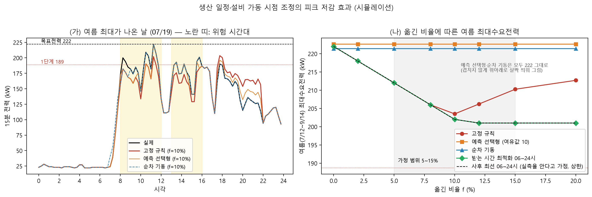

**그림 10. 피크 저감 시뮬레이션**

**주:** (가) 여름 최대가 나온 7/19(월): 고정 규칙이 11:15의 222kW 피크를 낮추고, 옮긴 부하는 17:30 이후에 나타난다. (나) 옮긴 비율에 따른 여름 최대를 고정 규칙, 예측 선택형, 순차 기동, 받는 시간 최적화(06~24시), 사후 최선으로 비교한다.

10% 이동을 모든 가동일에 적용하면 여름 최대전력은 222kW에서 203.5kW로 낮아지고, 1단계 초과 구간은 248개에서 35개로 줄었다. 선택Ⅰ 기준 연 기본요금 절감은 약 160만 원이다. 다만 이동한 작업이 새 피크를 만들 수 있었다. 조정 후 최대는 받는 시간인 7월 19일 17:45에 발생했으며, 15%로 이동량을 늘리면 받는 시간의 부하가 높아져 최대전력이 오히려 210.3kW로 상승했다.

다른 운영 방식도 비교하였다. 하루 앞 예측이 높은 구간에서만 이동하는 방식은 7월 19일의 222kW 피크를 놓쳤고, 여유값을 바꾸면 결과가 크게 흔들렸다. 1시간 앞 경보에 대응하는 방식은 2~5주차의 피크 구간을 60개에서 14개로 줄였지만, 놓친 구간이 남은 최대를 결정했다. 08시 설비를 07시로 나누어 켜는 순차 기동도 여름 최대가 11시대에 발생해 최대전력 저감에는 효과가 없었다(부록 표 A-33·A-34).

### 4-3. 이동한 작업의 시간 배치와 재계획

이동량이 커질수록 받는 시간의 부하를 관리해야 한다. 이에 하루 96개 15분 구간을 연결한 선형계획으로 배치를 정하였다. 위험 시간대에서 줄이는 규칙은 유지하고, 받는 시간의 예상 최대전력을 먼저 낮춘 뒤 같은 조건에서는 전력량요금이 싼 시간을 선택했다. 같은 날 줄인 전력량을 모두 다시 사용하도록 하였고, 추가 인건비는 기존 교대 인원을 활용한다는 조건으로 0으로 두었다.

최적화 결과는 옮길 총량을 언제 아느냐에 따라 달라진다. 실제 전력으로 총량을 계산한 재생 실험에서는 10% 이동의 최대전력이 202.0kW, 15% 이동은 201.0kW였다. 받는 시간은 대부분 위험 시간대 뒤라 그때는 총량을 알 수 있지만, 06~08시처럼 먼저 받는 배치에는 미래 정보가 들어간다. 그래서 총량까지 전날 예측으로 정한 방안도 평가했고, 결과는 10%에서 206.4kW, 15%에서 201.0kW였다.

10% 재생 실험의 202.0kW는 위험 시간대에서 해당 비율을 줄인 뒤 남는 부하의 하한이었다. 15%의 201.0kW는 이동 대상이 아닌 7월 20일 16:00의 부하로 결정되었다. 같은 이동량과 시간 범위에서 실제 전력을 미리 알고 배치하는 사후 최선과도 최대값이 같았다(부록 표 A-35).

총량까지 전날 예측한 10% 방안은 실제 부하가 높은 날에 덜 이동하여 고정 규칙의 203.5kW보다 나빴다. 줄이는 시간까지 예측으로 선택한 방안도 217.3kW에 그쳤다. 그래서 전날 예측은 옮길 작업과 총량을 현장에서 확인한 뒤 받는 시간을 정하는 데 쓴다.

당일에는 매 정시 1시간 앞 예측으로 남은 배치를 다시 계산하였다. 시험 기간의 15% 이동 재생 실험에서 최대전력은 하루 앞 배치 196.2kW에서 195.2kW로 낮아졌고, 받는 시간을 24시까지 넓히면 194.0kW가 되었다. 10%에서는 198.4kW로 같았다. 개선 폭은 작았고, 이 결과도 이동 총량을 실제 전력으로 계산한 조건이다(부록 표 A-36).

### 4-4. 규칙 준수와 예측 오차의 영향

203.5kW의 저감 결과는 매일 10%를 이동하고 모든 가동일에 규칙을 지킨다는 조건이다. 실제 운영에서는 이동 가능한 부하와 규칙 준수 여부가 달라질 수 있어 두 종류의 불확실성을 별도로 확인하였다.

**규칙 준수의 영향.** 관측된 42일의 부하는 고정하고, 날별 이동 비율을 5~15%에서 뽑고 준수 여부를 독립적으로 정해 4,000번 계산하였다. 매일 규칙을 지켜도 이동량이 달라지면 기대 절감은 연 127.7만 원으로, 10% 고정 가정보다 작았다. 최대전력으로 요금이 정해지므로 부하를 적게 옮긴 하루가 전체 효과를 제한하기 때문이다.

모든 날에 고르게 90%를 지키는 경우 기대 절감은 연 84.2만 원, 절감이 없는 경우의 비율은 9.9%였다. 주의일은 반드시 지키고 나머지 날은 80%를 지키면 전체 기대 준수율은 84.3%였지만, 기대 절감은 연 87.3만 원이었고 절감이 없는 경우는 4,000회 중 0회였다. 이번 가정에서는 주의일을 지키는 것이 절감 실패를 막는 데 가장 효과적이었다(부록 표 A-37, 그림 11).

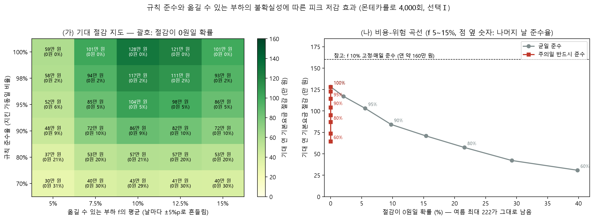

**그림 11. 규칙 준수 방식에 따른 기대 절감과 절감 0원 확률(몬테카를로 4,000회)**

**주:** (가) 옮길 수 있는 부하의 평균과 준수율에 따른 기대 절감. (나) 고르게 준수(회색)는 준수율이 낮아질수록 절감 0원 확률이 커지지만, 주의일을 반드시 지키면(빨강) 이 가정 아래 절감 0원이 0건이다(전체 준수율도 함께 오른다).

**예측 오차의 영향.** 과거 오차로 300개 시나리오를 만들어 받는 시간을 배치하자, 최대전력은 10% 이동 202.0kW, 15% 이동 201.0kW로 같았다. 새로 주의 기준을 넘은 받는 칸은 각각 1개에서 0개, 4개에서 0개로 줄었으나 차이의 95% 범위에 0이 포함되어 개선을 확정할 수 없었다. 시험 기간만 본 15% 비교에서도 1개에서 0개로 줄었지만 개선은 명확하지 않았다.

이 배치는 높은 부하가 예상되는 시간을 피하면서 전력량요금 절감이 47.2만 원에서 38.1만 원으로 줄어드는 비용을 수반했다. 별도로 시험한 보수적 배치는 최대전력이 219.0kW로 나빴지만, 목적과 오차 시나리오가 함께 달라 원인을 나누지 못했다. 효과가 확인되지 않고 비용이 드는 만큼, 오차 시나리오 배치는 기본 운영안에 넣지 않았다(부록 표 A-38·A-39, 부록 그림 A-17).

### 4-5. 요금 절감과 설비 투자 판단

데이터의 단가는 2021년 산업용(을) 고압A 선택Ⅰ의 최대부하 단가와 일치하여 이를 계산 계약으로 가정하였다. 실제 계약 종류, 선택요금, 계약전력은 고지서로 확인해야 한다.

2021년 선택Ⅰ과 선택Ⅱ는 전력량 단가가 kWh당 5.5원, 기본요금이 kW당 월 1,100원 차이 난다. 월 사용량을 요금적용전력으로 나눈 사용시간이 200시간을 넘으면 선택Ⅱ가 유리하며, 분석 기간의 추정 사용시간은 278~333시간이었다(부록 표 A-40).

**표 17. 비용 효과 (2021년 요금표, 연간)**

| 방안 | 계약 | 요금적용전력 | 연 기본요금 | 기본요금 변화 | 전력량요금 변화 | 현재 대비 연 절감 |
|---|---|---|---|---|---|---|
| 현재 | 선택Ⅰ | 222kW | 1,923.4만 원 | – | – | – |
| 피크 저감만(고정 규칙, 10%) | 선택Ⅰ | 203.5kW | 1,763.1만 원 | −160.3만 원 | 0 | **약 160만 원** |
| 요금제만 변경 | 선택Ⅱ | 222kW | 2,216.4만 원 | +293.0만 원 | −454.5만 원 | **약 162만 원** |
| 둘 다 | 선택Ⅱ | 203.5kW | 2,031.7만 원 | +108.3만 원 | −454.5만 원 | **약 346만 원** |

**주:** 연 절감 = 기본요금 변화 + 요금제 변경에 따른 전력량요금 변화(모두 연간, 음수가 절감)이다. 작업 이동으로 싼 시간에 전력을 쓰는 데서 생기는 전력량요금 절감(연 약 78만 원)은 이동 가능한 부하 가정에 크게 좌우되어 넣지 않았다. 요금적용전력 = max(반영월의 중간·최대부하 시간대 최대, 계약전력 × 30%)이며, 계약전력의 30%가 203.5kW 이하라고 가정하였다. 부가세·기금은 빼고, 1년 사용량은 7~9월 하루 평균 × 365로 어림하였다. 선택Ⅱ는 kW당 기본요금이 더 비싸 같은 18.5kW 저감이 연 약 184.7만 원이 된다(계약 종류별 비교: 부록 표 A-41). 작업 이동의 전력량요금 절감까지 넣은 값은 부록 표 A-42에 있다.

요금제 변경만 적용한 절감 추정치는 연 약 162만 원이다. 고정 규칙에 따른 10% 이동을 함께 적용하면 연 약 346만 원으로 추정된다. 선택Ⅱ는 kW당 기본요금이 더 비싸 같은 피크 저감이 더 큰 금액이 되므로, 두 금액의 합(약 322만 원)보다 크다.

이 결과는 겨울 최대전력과 계약전력의 30% 하한이 203.5kW 이하라는 조건을 포함한다. 계약전력이 700kW라면 하한이 210kW가 되어 선택Ⅰ 기준 기본요금 절감은 약 104만 원으로 줄어든다. 연 사용량도 7~9월 평균으로 추정한 값이며 부가세·기금은 제외하였다. 공휴일·토요일의 요금 예외를 반영했으며, 현재 적용에는 2026년 요금 개편과 실제 계약의 시간대표에 맞춰 받는 시간을 다시 설계해야 한다(부록 표 A-41).

ESS는 요금제와 운영 규칙을 적용한 뒤 추가 투자의 경제성을 검토하였다. 동시 최적화에서 약 26.5kWh의 ESS가 선택되었지만, 추가 순이익은 연 약 24만 원, 회수 기간은 약 8.3년이었다. 실제 전력을 미리 알고 운전한다는 조건과 기간 전체의 방전량 제약으로 계산했으므로, 실제 운전 수익은 이보다 낮을 것이다. 설치 단가가 25% 높거나 수명이 10년이거나 할인율이 7%인 조건에서는 검토 범위 내 ESS 투자가 유리하지 않았다(부록 표 A-42·A-43).

현장에서는 **계약·요금제 확인, 작업 시간 조정, 설비 투자 검토** 순으로 진행하기를 권한다. ESS는 단가와 운전 제약을 다시 확인한 뒤 20kWh 이하 소형 설비부터 별도로 검토한다.

### 4-6. 피크 관리 도우미

예측과 운영 절차를 담당자가 쓸 수 있도록 피크 관리 도우미를 만들었다. 매 정시 '정상' 또는 '준비'를 판단해 조치와 숫자 근거를 함께 보여 주며(그림 8), 2~5주차 가동일의 알림은 하루 평균 4.3회였다. 위험 시간대에서 경보가 표시된 구간의 실제 피크 비율은 18.8%, 경보가 없는 구간은 3.7%였으므로, 경보가 꺼져 있어도 큰 작업을 더할 때는 따로 확인한다(부록 표 A-44).

담당자 질문에는 규칙으로 질문 종류를 나눈 뒤 예측·경보·시간 배치·요금 계산 도구의 결과로 답한다. 생성형 모델을 쓰지 않아 답의 숫자는 모두 계산 결과에서 나오고, 설비 제어·인원 배치처럼 범위 밖의 질문에는 답하지 않는다. 연구팀이 작성한 질문 46개에서 분류와 도구 선택이 모두 맞았지만, 현장 담당자의 실제 표현으로는 아직 확인하지 않았다(부록 표 A-45, 부록 그림 A-18).

## 제5장. 창의성 및 차별성

### 5-1. 제안 방법의 기여

본 분석은 새로운 알고리즘을 만들기보다 세 가지 원칙을 지켰다. 첫째, 품질 점수를 그대로 믿지 않고 기록 자체를 점검하여 반복 기록을 걸러냈다(같은 시험 기간 오차 13.52 → 7.60kW). 둘째, 공장의 가동 계획과 요금 제도를 모델과 평가 기준에 직접 넣었다(달력 대신 생산계획으로 가동 구분, 하루 앞 오차 14.47 → 7.32kW). 셋째, 결과가 우연인지 날짜 단위로 확인하고, 개선이 확인되지 않은 후보는 채택하지 않았다. 그 위에서 예측이 놓치는 피크를 고정 규칙이 맡도록 운영안을 설계하였다.

**표 18. 주요 기여와 현장 의미**

| 기여 | 주요 결과 | 현장 의미 |
|---|---|---|
| 반복 기록 진단과 시간 순서 평가 | 같은 시험 기간 오차 13.52 → 7.60kW | 기록의 형식뿐 아니라 내용과 평가의 독립성도 확인 |
| 생산계획 기반 가동 구분 | 하루 앞 MAE 14.47 → 7.32kW | 달력보다 실제 가동 계획을 우선 활용 |
| 최근 전력과 사전학습 모델의 결합 | 1시간 앞 MAE 14.48 → 5.85kW | 당일 기동 판단과 경보의 정확도 개선 |
| 고정 규칙과 시간 배치의 결합 | 10% 이동 시 최대전력 222 → 203.5kW | 예측 실패 조건을 고려해 위험 시간대의 부하를 사전 조정 |
| 불확실성과 비용의 동시 검토 | 경보·규칙 준수·이동 총량·투자 가정별 결과 비교 | 평균 성능과 함께 실행 조건 및 비용 효과를 확인 |

이 밖에 사용한 검증 방법(SHAP 상호작용, Diebold–Mariano 검정, 확률 분류기 비교, 예측구간 보정, 시나리오 배치, 몬테카를로, 도우미 평가)과 각각의 결과는 부록 표 C-1에 정리하였다.

가이드북 실습과 다른 점은 두 가지이다. 무작위 분할 대신 과거로 학습해 미래로 평가하였고, 한 시점의 비용 선택을 하루 96개 구간의 작업 이동 문제로 넓혀 최대전력과 옮긴 전력량을 함께 따졌다.

### 5-2. 다른 공장에 적용하는 방법

예측·경보의 시제품은 15분 전력, 생산계획의 가동·휴무와 교대 정보, 달력으로 시작할 수 있다. 다만 실제 작업 이동까지 적용하려면 설비별 이동 가능량, 연속 운전 조건, 작업자와 납기 여유를 추가로 확인해야 한다.

1. **데이터와 운영 패턴 확인:** 반복 기록, 0값, 시간 순서를 점검하고 하루 종류·전날 가동·시각별 기준 곡선을 추정한다.
2. **당일 예측 보정:** 기준 곡선과 현재 편차의 선형 회귀를 학습하고, 사전학습 모델을 추가했을 때 성능이 개선되는지 비교한다.
3. **경보 기준 조정:** 해당 공장의 요금적용전력과 대응 비용을 기준으로 주의·차단선과 준비 여유값을 검증한다. 본 분석의 85%·90%는 이 공장에 맞춘 값이다.
4. **운영안 검증:** 위험 시간대와 이동 가능한 작업을 정하고, 시간 배치·준수율·현재 요금에 따른 비용 효과를 확인한다.

열처리로처럼 1~2시간 이어지는 큰 부하가 많으면 15분 단위의 이동 가정을 그대로 적용하기 어렵다. 이런 공장은 설비별 계측과 공정 제약부터 확인한다.

## 제6장. 코드 구성 및 재현성

### 6-1. 분석 과정과 산출물

노트북 번호는 서면평가 항목 순서(1 데이터 → 2 예측모델 → 3 영향요인·오류 → 4 현장 활용 → 6 재현성)를 따른다. 각 노트북의 결과가 다음 노트북의 입력으로 이어지며, `run_all.py` 한 번으로 정해진 순서에 따라 모든 표·그림·예측값을 다시 만든다. 결과 파일은 표 `t01~t58`, 시간 단위 분석 표 `h01~h05`, 영향요인 표 `e01~e10`, 그림 `f01~f32`의 번호로 찾을 수 있다.

**표 19. 노트북 구성과 산출물**

| 노트북 | 하는 일 | 주요 산출물 | 장 |
|---|---|---|---|
| 01-1_데이터_구조와_품질진단 | 데이터 구조, 품질 진단, 전력 사용 패턴 | f01~f09, t01~t06 | 1장 |
| 01-2_전처리와_검증전략 | 전처리, 생산계획 기반 하루 종류, 5주 평가 설계 | 15분 데이터, f10~f11, t07~t09 | 1·2장 |
| 02-1_사전학습모델_Chronos2 | Chronos-2 하루 앞·1시간 앞 예측과 분위수 21개 | Chronos-2 예측값 | 2·3장 |
| 02-1b_딥러닝_통계모델_예측 | MSTL·ARIMA·NHITS·TFT 예측 | 추가 후보 예측값 | 2장 |
| 02-1c_외부자료_Chronos2_미세조정 | 다른 공장 자료로 Chronos-2 LoRA 미세조정 | 미세조정 예측값 | 2장 |
| 02-2_15분_예측모델_비교와_선정 | 모델 비교, 부트스트랩·DM 검정, 1~6월 사용 실험, 선택 편향 점검, 최종 모델과 구조도 | f12~f15·f31~f32, t10~t17·t33·t56~t58 | 2장 |
| 02-3_피크기준_경보와_오류분석 | 피크 기준, 경보, 확률 분류기 비교, 오류·영향요인, SHAP 상호작용, 예측구간 | f16~f21·f25·f30, t18~t28·t34~t36·t44~t45·t52~t55 | 3장 |
| 02-4_피크위험확률_모델비교 | 시간 최대 모델과 피크 위험 확률 모델(분류기·분위수 확률·스태킹)을 같은 5주에서 비교 | h01~h05 | 2·3장 |
| 03-1_실험모델_영향요인과_오류분석 | 실험 모델의 SHAP·상호작용, 경보 방법별 놓친 피크·헛경보 조건 | e01~e10 | 3장 |
| 04-1_피크저감_운영안 | 피크 저감, 요금 효과, 받는 시간 최적화·재계획, 몬테카를로, 투자 판단 | f22~f23·f27, t29~t32·t37~t40·t42~t43·t47~t50 | 4장 |
| 04-2_피크관리_도우미 (+ peak_helper.py) | 매시 판단 기록, 규칙 기반 질의응답 | decision_log.csv, f24·f29, t41·t51 | 4장 |
| 06_테스트_예측결과_생성 | 제출용 테스트 예측결과 파일 생성과 지표 대조 | test_predictions.csv | 6장 |
| 부록 hourly_max_pipeline | 1시간 최대 예측 파이프라인(모델 15종 이상, 6 fold 검증 + 9/1~9/14 시험) | 부록 표·그림 | 2장 참고 |

### 6-2. 재현성과 검증 범위

실행 환경은 Python 3.12.14 하나이며 `requirements.txt`(또는 `environment.yml`)로 설치한다. GPU 없이 CPU로 실행한다. 프로젝트 최상위 폴더에서 다음 명령으로 실행한다.

```powershell
python run_all.py                  # 02-1 계열(사전학습·딥러닝·미세조정)은 저장된 예측을 쓰고 나머지를 처음부터 실행
python run_all.py --with-chronos   # 02-1 계열도 다시 계산(CPU로 수 시간)
python run_all.py --appendix       # 부록 노트북도 저장된 결과로 다시 실행
python run_all.py --check          # 실행 전후 결과표가 한 글자도 다르지 않은지 비교
```

학습에 시간이 오래 걸리는 02-1 계열은 기본 실행에서 저장된 예측을 쓰고, `--with-chronos`로 다시 계산할 수 있다. 02-1c는 외부 자료 3개 파일(`data/external/`)을 쓰며 노트북이 파일의 SHA-256 값을 확인한다. 원본 데이터의 해시, 난수 시드, 사전학습 모델의 가중치 버전과 패키지 버전을 고정하였고, 다시 실행해도 결과표가 바뀌지 않는 것을 확인하였다(CPU가 다르면 일부 표에서 소수 13자리 이하 차이만 생긴다). 처음 실행하는 PC는 README의 명령으로 Chronos-2 가중치를 미리 받는다.

자동 검사 18개(`tests/`)로 다음을 확인한다. 전력에서 계산된 열을 쓰지 않는지, 하루 앞 예측을 각 시험 주 이전 자료만으로 똑같이 다시 만드는지, 예측 발행 시각과 대상 시각이 맞는지, 도우미가 발행 시각 이후 정보를 쓰지 않는지, 시간 최대 입력이 예측 시점 이후 값을 바꿔도 그대로인지(교란 검사), 제출 파일의 기간과 열이 맞는지, 블라인드 금지어가 없는지이다. 15분 1시간 앞 모델에는 교란 검사를 아직 넣지 않았다.

## 결론과 한계

### 결론

분석의 출발점은 기록의 신뢰성이었다. 반복 기록을 제외하고 시간 순서대로 평가한 뒤, 생산계획으로 가동 여부를 구분하는 하루 앞 모델과 최근 전력을 반영하는 1시간 앞 모델을 선정하였다. 예측은 작업 계획과 당일 경보에 유용했지만, 요금을 결정하는 짧은 피크를 모두 포착하지는 못했다.

**표 20. 질문별 답**

| 질문 | 답 |
|---|---|
| ⓪ 데이터는 답할 수 있는 상태인가 | 1~9월 257일 중 62%가 다른 날과 전력 기록이 완전히 같았다. 이런 날이 없는 7~9월만 쓰고, 시간 순서대로 평가하였다 |
| ① 얼마나 정확히 예측하나 | 하루 앞 MAE 7.32kW(생산계획 기반 기준 곡선), 1시간 앞 MAE 5.85kW(선형 회귀 + Chronos-2 평균) |
| ② 언제 틀리고, 피크는 언제 생기나 | 평일 주간, 특히 평소와 다르게 운영한 날에 틀린다. 피크는 평일 08~16시와 월요일 오전에 몰린다. 1시간 앞 경보는 피크 칸의 77%를 잡지만, 하루 앞 예측은 넘는 날을 고르지 못한다 |
| ③ 무엇을 하면 얼마나 아끼나 | 위험 시간대를 비우는 고정 규칙으로 여름 최대 222 → 203.5kW(연 약 160만 원), 요금제 변경과 함께하면 연 약 346만 원(선택Ⅰ 가정의 추정) |

따라서 도입은 다음 순서로 진행하도록 제안한다.

1. **계약 확인:** 최근 12개월 고지서와 계약전력으로 현재 선택요금, 월 사용시간, 요금적용전력을 확인하고 유리한 계약을 비교한다.
2. **운영 규칙 협의:** 여름 위험 시간대의 배치형 작업을 조정하고, 월요일과 휴무 직후의 준수를 강화한다. 1시간 앞 경보는 신규 부하를 추가하기 전 확인 신호로 교육한다.
3. **현장 검증:** 주요 설비를 1~2주 간이 계측하고 기동 기록을 수집해, 이동 가능한 부하와 준수율을 실제 값으로 바꾸어 효과를 다시 계산한다.

### 한계와 추가 확인 사항

**데이터와 평가 기간.** 전력이 기록된 날은 74일(분석 기간 76일), 시험 기간은 37일에 한정된다. 경보의 피크 사건 수도 적어 재현율 0.77의 95% 범위는 0.58~0.87로 넓었다. 전력값의 단위와 정의가 원자료에 없어 15분 평균 전력(kW)으로 가정하였고, 생산량이 계획인지 실적인지, 222kW가 실제 최대인지 계측 상한인지도 확인하지 못했다. 최종 모델을 같은 시험 기간에서 골랐으므로 새로운 기간의 성능은 별도 검증해야 한다(앞 주로만 다시 고른 추정으로는 0.09~0.15kW 나빠짐, 2-6). 기온 비교도 실제 기온을 아는 조건으로 수행한 참고 실험이다. SHAP과 상관 분석은 이 자료에서 함께 나타난 관계를 보여 줄 뿐이며, 원인을 확인하려면 설비 계측이나 운영 실험이 필요하다.

**작업 이동의 실행 가능성.** 이동 비율 10%(비교 범위 5~15%)는 가정값이다. 옮기기 전후의 전력량만 같게 맞췄으므로 작업자 배치·공정 대기·품질·납기는 따로 확인해야 한다. 연속 운전 설비는 15분 단위로 나누어 이동하기 어려울 수 있다. 받는 시간의 새 피크와 재계획 효과는 여름 가동일 42일의 시뮬레이션으로만 평가하였다. 일부 최적화·재계획은 이동 총량을 실제 전력으로 계산한 재생 실험이며, 총량까지 전날 예측하면 10% 결과가 206.4kW로 달라졌다. 도우미의 질문도 연구팀이 작성한 범위에서만 평가하였다.

**비용과 계약 조건.** 비용은 2021년 요금표와 선택Ⅰ 가정에 근거하고, 연간 사용량은 7~9월 평균으로 추정하였다. 겨울 최대와 계약전력 하한에 따라 기본요금 절감은 달라질 수 있으므로 실제 고지서 12개월로 확인해야 한다. ESS와 수요반응(DR)은 투자 검토 수준이며 역률 개선은 다루지 않았다. ESS 경제성은 가격·수명·할인율과 운전 제약에 민감하다.

---

## 부록 A. 상세 결과표

### 표 A-1. 품질 지수 (%)

| 항목 | 가중치 | 가이드북 방식 | 엄격한 범위 점검 |
|---|---|---|---|
| 완전성 | 20.0 | 100.0 | 100.0 |
| 유일성 | 10.0 | 99.69 | 99.69 |
| 유효성 | 20.0 | 100.0 | 99.22 |
| 일관성 | 20.0 | 100.0 | 100.0 |
| 정확성 | 20.0 | 100.0 | 100.0 |
| 무결성 | 10.0 | 66.67 | 33.33 |
| 종합 품질 점수 | 100.0 | 96.64 | 93.15 |

### 표 A-2. 월별 복사 의심일

| 월 | 전체 일수 | 복사 의심 일수 | 비율 |
|---|---|---|---|
| 1월 | 31 | 27 | 87% |
| 2월 | 28 | 28 | 100% |
| 3월 | 31 | 28 | 90% |
| 4월 | 30 | 30 | 100% |
| 5월 | 31 | 17 | 55% |
| 6월 | 30 | 28 | 93% |
| 7월 | 31 | 2 | 6% |
| 8월 | 31 | 0 | 0% |
| 9월 | 14 | 0 | 0% |

### 표 A-3. 요일별 하루 종류 (일수, 7/1~9/14)

| 요일 | 평일 가동 | 토요일 | 휴일 |
|---|---|---|---|
| 월 | 10 | 0 | 1 |
| 화 | 10 | 0 | 1 |
| 수 | 9 | 0 | 1 |
| 목 | 10 | 0 | 1 |
| 금 | 10 | 0 | 1 |
| 토 | 0 | 9 | 2 |
| 일 | 0 | 0 | 11 |

### 표 A-4. 평가 주차

| 주차 | 시험 기간 | 학습 기간 | 학습 일수 | 시험 일수 | 정답 칸 수 |
|---|---|---|---|---|---|
| 1주차 | 08/09~08/15 | 07/01~08/08 | 39 | 7 | 672 |
| 2주차 | 08/16~08/22 | 07/01~08/15 | 46 | 7 | 672 |
| 3주차 | 08/23~08/29 | 07/01~08/22 | 53 | 7 | 600 |
| 4주차 | 08/30~09/05 | 07/01~08/29 | 60 | 7 | 672 |
| 5주차 | 09/06~09/14 | 07/01~09/05 | 67 | 9 | 862 |

### 표 A-5. 하루 앞·1시간 앞 예측: Diebold–Mariano 검정 (최종 모델 대비)

| 예측 | 후보 | 날짜별 MAE 차이 평균 (kW) | DM 통계량 | p값 | 판정 |
|---|---|---|---|---|---|
| 하루 앞 예측 | 기준 곡선 + LightGBM 평균 | 0.01 | 0.6 | 0.5531 | 차이 확인 안 됨 |
| 하루 앞 예측 | 기준 곡선 + Chronos-2 평균 | -0.1 | -0.35 | 0.7293 | 차이 확인 안 됨 |
| 하루 앞 예측 | 중앙값 기준 곡선 | 0.12 | 2.68 | 0.0110 | 최종이 더 정확 |
| 하루 앞 예측 | Chronos-2 (+가동 계획) | 0.47 | 0.8 | 0.4307 | 차이 확인 안 됨 |
| 하루 앞 예측 | Chronos-2 (+기준 곡선) | 0.66 | 1.1 | 0.2780 | 차이 확인 안 됨 |
| 하루 앞 예측 | Chronos-2 (기록만) | 1.54 | 0.98 | 0.3314 | 차이 확인 안 됨 |
| 하루 앞 예측 | LightGBM (달력+계획) | 1.58 | 5.24 | 0.0000 | 최종이 더 정확 |
| 하루 앞 예측 | 최근 4주 같은 요일 | 1.91 | 3.09 | 0.0039 | 최종이 더 정확 |
| 하루 앞 예측 | LightGBM (+과거 전력) | 3.44 | 3.34 | 0.0020 | 최종이 더 정확 |
| 하루 앞 예측 | 지난주 같은 시각 | 15.6 | 2.67 | 0.0112 | 최종이 더 정확 |
| 1시간 앞 예측 | Chronos-2 (+가동 계획) | 0.22 | 2.49 | 0.0175 | 최종이 더 정확 |
| 1시간 앞 예측 | 선형 회귀 | 0.4 | 3.63 | 0.0009 | 최종이 더 정확 |
| 1시간 앞 예측 | 기준 곡선 + 현재 편차 | 0.48 | 3.31 | 0.0021 | 최종이 더 정확 |
| 1시간 앞 예측 | 칼만 필터 보정 | 0.49 | 3.37 | 0.0018 | 최종이 더 정확 |
| 1시간 앞 예측 | LightGBM | 0.69 | 4.05 | 0.0003 | 최종이 더 정확 |
| 1시간 앞 예측 | 기준 곡선만 | 1.48 | 4.51 | 0.0001 | 최종이 더 정확 |
| 1시간 앞 예측 | 직전 값 그대로 | 8.46 | 10.39 | 0.0000 | 최종이 더 정확 |

**주:** 날짜별 '후보 MAE − 최종 MAE'의 평균을 검정하였다(HLN 소표본 보정, t분포, 양측, 시험일 37일). 두 모델이 모두 예측한 구간만 사용한다.

### 표 A-6. 하루 앞 예측: 기본 6개 모델 (kW)

| 모델 | MAE | RMSE | 고부하 구간 MAE | 하루 최대 전력 오차 | 주별 MAE 범위 |
|---|---|---|---|---|---|
| ① 지난주 같은 시각 | 23.68 | 46.86 | 65.23 | 34.84 | 8.2~81.8 |
| ② 최근 4주 같은 요일 | 9.16 | 13.95 | 11.78 | 11.85 | 7.2~11.2 |
| ③ 생산계획 기반 기준 곡선 | 7.32 | 10.98 | 7.99 | 7.23 | 6.7~9.1 |
| ④ LightGBM(달력+계획) | 8.94 | 12.95 | 10.42 | 9.53 | 8.0~11.6 |
| ⑤ LightGBM(+과거 전력) | 10.84 | 16.30 | 21.42 | 13.49 | 7.9~20.0 |
| ⑥ 기준 곡선 + LightGBM 보정 | 8.02 | 12.01 | 8.90 | 7.92 | 6.9~10.9 |

### 표 A-7. 하루 앞 예측: 기준 곡선과의 차이 검정

| 비교 모델 | MAE 차이(비교 모델 − ③, kW) | 95% 범위 | 판정 |
|---|---|---|---|
| ① 지난주 같은 시각 | 16.24 | 5.31~28.71 | ③이 더 정확 |
| ② 최근 4주 같은 요일 | 1.87 | 0.85~3.07 | ③이 더 정확 |
| ④ LightGBM(달력+계획) | 1.64 | 1.10~2.26 | ③이 더 정확 |
| ⑤ LightGBM(+과거 전력) | 3.57 | 1.73~5.83 | ③이 더 정확 |
| ⑥ 기준 곡선 + LightGBM 보정 | 0.71 | 0.31~1.20 | ③이 더 정확 |

### 표 A-8. 하루 앞 예측: 추가 후보 (kW)

| 모델 | MAE | 고부하 구간 MAE | 하루 최대 전력 오차 | 최종과 MAE 차이 (95% 범위) | 판정 |
|---|---|---|---|---|---|
| 기준 곡선(최종) | 7.32 | 7.99 | 7.23 | – | – |
| 중앙값 기준 곡선 | 7.44 | 7.84 | 7.01 | 0.12 (0.04~0.21) | 기준 곡선이 더 정확 |
| 기준 곡선 + LightGBM 평균 | 7.34 | 7.95 | 7.59 | 0.02 (−0.03~0.06) | 우연 범위 |
| Chronos-2(기록만) | 8.67 | 19.03 | 12.11 | 1.35 (−0.66~4.77) | 우연 범위 |
| Chronos-2(+가동 계획) | 7.54 | 10.98 | 8.72 | 0.22 (−0.48~1.05) | 우연 범위 |
| Chronos-2(+기준 곡선) | 7.74 | 10.40 | 7.85 | 0.42 (−0.28~1.26) | 우연 범위 |
| 기준 곡선 + Chronos-2 평균 | 7.10 | 9.09 | 7.36 | −0.22 (−0.59~0.20) | 우연 범위 |

### 표 A-9. 1시간 앞 예측: 전체 후보 (kW)

| 모델 | MAE | 고부하 구간 MAE | 첫 15분 | 45~60분 | 최종과 MAE 차이 (95% 범위) |
|---|---|---|---|---|---|
| 직전 값 그대로 | 14.48 | 22.56 | 12.90 | 15.50 | – |
| 생산계획 기반 기준 곡선 | 7.32 | 7.99 | 6.98 | 7.59 | – |
| 기준 곡선 + 현재 편차 | 6.35 | 7.84 | 5.01 | 7.19 | 0.50 (0.26~0.78) |
| 선형 회귀(Ridge) | 6.26 | 8.33 | 5.11 | 7.00 | 0.42 (0.21~0.62) |
| LightGBM | 6.52 | 9.07 | 5.53 | 7.10 | 0.67 (0.39~1.00) |
| 칼만 필터 보정 | 6.36 | 8.12 | 5.48 | 6.94 | 0.51 (0.24~0.80) |
| Chronos-2(+가동 계획) | 6.06 | 9.37 | 5.11 | 6.88 | 0.22 (0.05~0.41) |
| 선형 회귀 + Chronos-2 평균(최종) | 5.85 | 8.40 | 4.88 | 6.58 | – |

### 표 A-10. 통계·딥러닝·미세조정 후보와 최종 모델 비교 (5주 시험)

| 예측 | 모델 | MAE (kW) | RMSE (kW) | 상대오차 | 최종 대비 MAE 차이 (95% 범위) | DM p값 | 판정 |
|---|---|---|---|---|---|---|---|
| 하루 앞 | 기준 곡선 (최종) | 7.32 | 10.98 | 7.0% | – | – | 최종 모델 |
| 하루 앞 | 기준 곡선 + ARIMA (+기준 곡선) 평균 | 7.21 | 10.88 | 6.9% | −0.11 (−0.50~0.23) | 0.677 | 우연 범위 |
| 하루 앞 | ARIMA (+기준 곡선) | 7.71 | 11.36 | 7.4% | 0.39 (−0.10~0.92) | 0.125 | 우연 범위 |
| 하루 앞 | 기준 곡선 + MSTL 평균 | 8.44 | 12.13 | 8.1% | 1.12 (0.11~2.25) | 0.055 | 최종이 더 정확(부트스트랩) |
| 하루 앞 | 기준 곡선 + TFT 평균 | 9.09 | 13.57 | 8.7% | 1.77 (1.42~2.14) | <0.001 | 최종이 더 정확 |
| 하루 앞 | 기준 곡선 + NHITS 평균 | 9.54 | 14.63 | 9.2% | 2.22 (0.87~3.96) | 0.011 | 최종이 더 정확 |
| 하루 앞 | 기준 곡선 + ARIMA (+달력·가동 계획) 평균 | 11.20 | 14.51 | 10.8% | 3.88 (2.68~5.14) | <0.001 | 최종이 더 정확 |
| 하루 앞 | MSTL | 11.64 | 17.18 | 11.2% | 4.32 (2.26~6.87) | 0.001 | 최종이 더 정확 |
| 하루 앞 | TFT (+가동 계획) | 12.18 | 19.65 | 11.7% | 4.86 (3.97~5.74) | <0.001 | 최종이 더 정확 |
| 하루 앞 | NHITS (+가동 계획) | 13.96 | 22.85 | 13.4% | 6.64 (3.51~10.77) | 0.001 | 최종이 더 정확 |
| 하루 앞 | ARIMA (+달력·가동 계획) | 18.11 | 23.70 | 17.4% | 10.79 (8.40~13.25) | <0.001 | 최종이 더 정확 |
| 1시간 앞 | 선형 회귀 + Chronos-2 평균 (최종) | 5.85 | 8.53 | 5.6% | – | – | 최종 모델 |
| 1시간 앞 | 선형 회귀 + Chronos-2 미세조정 평균 | 5.85 | 8.52 | 5.6% | 0.00 (−0.02~0.02) | 0.703 | 우연 범위 |
| 1시간 앞 | 선형 회귀 + ARIMA (+기준 곡선) 평균 | 6.05 | 8.88 | 5.8% | 0.20 (0.01~0.37) | 0.049 | 최종이 더 정확 |
| 1시간 앞 | ARIMA (+기준 곡선) | 6.07 | 8.93 | 5.8% | 0.22 (0.01~0.39) | 0.032 | 최종이 더 정확 |
| 1시간 앞 | Chronos-2 미세조정 (다른 공장 자료) | 6.10 | 9.27 | 5.9% | 0.25 (0.08~0.43) | 0.007 | 최종이 더 정확 |
| 1시간 앞 | 선형 회귀 + NHITS 평균 | 7.23 | 10.46 | 6.9% | 1.38 (0.94~1.88) | <0.001 | 최종이 더 정확 |
| 1시간 앞 | 선형 회귀 + TFT 평균 | 8.15 | 12.20 | 7.8% | 2.30 (1.73~2.89) | <0.001 | 최종이 더 정확 |
| 1시간 앞 | 선형 회귀 + ARIMA (+달력·가동 계획) 평균 | 8.39 | 11.79 | 8.0% | 2.54 (2.03~3.08) | <0.001 | 최종이 더 정확 |
| 1시간 앞 | NHITS (+가동 계획) | 9.59 | 14.58 | 9.2% | 3.75 (2.71~4.93) | <0.001 | 최종이 더 정확 |
| 1시간 앞 | TFT (+가동 계획) | 11.75 | 19.25 | 11.3% | 5.90 (4.81~6.91) | <0.001 | 최종이 더 정확 |
| 1시간 앞 | ARIMA (+달력·가동 계획) | 13.25 | 19.35 | 12.7% | 7.40 (6.29~8.49) | <0.001 | 최종이 더 정확 |

**주:** 02-1b·02-1c 노트북의 예측을 02-2 노트북에서 같은 날짜 단위 부트스트랩과 Diebold–Mariano 검정으로 비교했다. 각 시험 주는 그 이전 자료로만 학습했다. NHITS는 과거 7일·최대 400단계, TFT는 CPU 시간 때문에 과거 2일·최대 150단계로 학습한 줄인 설정의 결과이며, 딥러닝 계열 전체의 결론은 아니다. Chronos-2 미세조정은 LoRA로 240단계 × 배치 8만 학습했다. 20개 비교 중 19개에서 부트스트랩과 DM 검정의 결론이 같았고, 기준 곡선 + MSTL 평균은 부트스트랩으로는 차이가 있었지만 DM은 p = 0.055였다. LSTM은 시험 한 주 학습에 40분 넘게 걸려 뺐다. MSTL은 정시마다 다시 분해하는 비용이 커서 1시간 앞에서는 뺐다.

### 표 A-11. 1시간 앞 예측: 주별 MAE (kW)

| 시험 주 | 최종(평균 결합) | 선형 회귀 | Chronos-2 | 최종이 선형 회귀보다 나은가 |
|---|---|---|---|---|
| 08/09 | 6.37 | 6.29 | 6.88 | 아니오 |
| 08/16 | 6.08 | 6.95 | 6.01 | 예 |
| 08/23 | 5.78 | 6.12 | 6.15 | 예 |
| 08/30 | 5.50 | 6.01 | 5.57 | 예 |
| 09/06 | 5.59 | 6.00 | 5.79 | 예 |

### 표 A-12. 1시간 최대 기준 평가 (15분 예측 4개의 최대 vs 실제 15분 값 4개의 최대)

| 예측 | 기간 | 시간 수 | 1시간 최대 MAE (kW) | 평균 오차 (kW) | 15분 MAE (kW, 같은 기간) |
|---|---|---|---|---|---|
| 하루 앞 (기준 곡선) | 8/9~9/14 (본 분석의 시험 기간) | 868 | 7.06 | -0.82 | 7.32 |
| 하루 앞 (기준 곡선) | 9/1~9/14 | 335 | 6.72 | -2.33 | 6.57 |
| 1시간 앞 (선형 회귀 + Chronos-2) | 8/9~9/14 (본 분석의 시험 기간) | 868 | 5.85 | -2.26 | 5.85 |
| 1시간 앞 (선형 회귀 + Chronos-2) | 9/1~9/14 | 335 | 5.75 | -2.60 | 5.41 |

**주:** 4개 구간이 모두 정답으로 쓰이는 시간만 사용한다. 평균 오차가 −이면 실제보다 낮게 예측한 것이다.

### 표 A-13. 부록 파이프라인: 1시간 최대를 직접 예측한 모델의 시험 결과 (9/1~9/14)

| 예측 | 모델 | 시험 MAE (kW) | 가동일 MAE (kW) |
|---|---|---|---|
| 1시간 앞 | Chronos-2 zero-shot (선정) | 5.20 | 5.92 |
| 1시간 앞 | Chronos-2 + 공변량 | 5.21 | 5.97 |
| 1시간 앞 | 앙상블(NNLS) | 5.05 | 5.90 |
| 1시간 앞 | LSTM | 5.39 | 6.31 |
| 1시간 앞 | CatBoost | 5.85 | 6.96 |
| 1시간 앞 | LightGBM | 6.04 | 6.97 |
| 1시간 앞 | 가이드북 RF | 5.84 | 7.02 |
| 1시간 앞 | MSTL | 6.04 | 6.77 |
| 1시간 앞 | NHITS | 6.36 | 7.55 |
| 1시간 앞 | 가이드북 RNN | 6.79 | 7.84 |
| 1시간 앞 | 직전 값 | 13.96 | 17.23 |
| 하루 앞 | Chronos-2 + 공변량 (선정) | 5.89 | 6.80 |
| 하루 앞 | Chronos-2 zero-shot | 6.04 | 6.99 |
| 하루 앞 | 앙상블(NNLS) | 5.79 | 6.75 |
| 하루 앞 | LightGBM | 6.61 | 7.10 |
| 하루 앞 | XGBoost | 6.35 | 7.25 |
| 하루 앞 | NHITS | 6.78 | 7.90 |
| 하루 앞 | MSTL | 7.68 | 8.19 |
| 하루 앞 | 가이드북 RNN | 7.97 | 9.42 |
| 하루 앞 | LSTM | 12.35 | 15.06 |
| 하루 앞 | 지난주 같은 시각 | 7.66 | 8.76 |

**주:** 예측 대상(1시간 최대), 학습 자료(1~9월), 시험 기간(9/1~9/14)이 본 분석과 달라 직접 비교하지 않는다. '선정'은 그 분석의 사전 등록 규칙으로 고른 모델이다. 그 분석의 검증 구간 일부에는 반복 기록이 섞여 있어 시험 결과만 인용한다.

### 표 A-14. 선택 편향 점검: 앞 주로만 다시 고른 모델의 2~5주차 성능

| 예측 | 고르는 방식 | 2~5주차에 고른 모델 (2·3·4·5주차) | 2~5주차 MAE (kW) | 고르지 않은 기준 모델과 차이 (95% 범위) | 최종 모델과 차이 (95% 범위) |
|---|---|---|---|---|---|
| 하루 앞 | 앞 주로 매주 다시 고름 (3-5 규칙) | 기준 곡선 / 기준 곡선 + ARIMA(+기준 곡선) 평균 / 기준 곡선 / 기준 곡선 | 7.72 | – | +0.09 (0.01~0.25) |
| 하루 앞 | 앞 주로 매주 다시 고름 (MAE 최소) | 기준 곡선 + ARIMA(+기준 곡선) 평균 ×3 / 기준 곡선 + Chronos-2 평균 | 7.42 | – | −0.21 (−0.74~0.28) |
| 하루 앞 | 1주차만 보고 한 번 고름 (MAE 최소) | 기준 곡선 + ARIMA(+기준 곡선) 평균 | 7.51 | – | −0.12 (−0.58~0.30) |
| 하루 앞 | (참고) 5주 결과로 고른 최종 모델 | 기준 곡선 | 7.63 | – | – |
| 1시간 앞 | 앞 주로 매주 다시 고름 (3-5 규칙) | 선형 회귀 + ARIMA(+기준 곡선) 평균 / ARIMA(+기준 곡선) / 선형 회귀 + 미세조정 Chronos-2 평균 / 최종 모델 | 5.87 | −0.39 (−0.59~−0.20) | +0.15 (0.04~0.27) |
| 1시간 앞 | 앞 주로 매주 다시 고름 (MAE 최소) | 위와 같음 | 5.87 | −0.39 (−0.59~−0.20) | +0.15 (0.04~0.27) |
| 1시간 앞 | 1주차만 보고 한 번 고름 (MAE 최소) | 선형 회귀 + ARIMA(+기준 곡선) 평균 | 6.02 | −0.23 (−0.40~−0.10) | +0.30 (0.16~0.47) |
| 1시간 앞 | (참고) 고르지 않고 선형 회귀만 씀 | 선형 회귀 | 6.26 | – | +0.53 (0.34~0.74) |
| 1시간 앞 | (참고) 5주 결과로 고른 최종 모델 | 선형 회귀 + Chronos-2 평균 | 5.72 | −0.53 (−0.74~−0.34) | – |

**주:** 후보는 표 8, 부록 표 A-6~A-10의 모든 모델이다. '3-5 규칙'은 더 복잡한 후보를 개선이 확인될 때만 채택하는 2장의 규칙을 그 주 이전 시험 주의 결과에만 적용한 것이다. 최종 모델은 5주 전체로 골랐으므로 2~5주차 값에는 선택 편향이 들어 있다. 앞 주로 다시 고른 값은 그 편향이 없는 추정치이다.

### 표 A-15. 피크 기준별 사례 수 (시험 기간 8/9~9/14)

| 기준 | 기준값 (kW) | 넘은 15분 칸 | 피크 사건 수 (연속 칸은 1회) | 넘은 날 |
|---|---|---|---|---|
| 목표전력의 80% | 178 | 346 | 141 | 26 |
| 목표전력의 85% (1단계) | 189 | 116 | 68 | 20 |
| 목표전력의 90% (2단계) | 200 | 18 | 12 | 6 |
| 목표전력의 95% | 211 | 3 | 2 | 2 |
| 목표전력의 100% | 222 | 0 | 0 | 0 |

### 표 A-16. 요금 시간대 민감도 (시험 기간)

| 기준 | 목표전력(시각) | 시험 기간 최대(시각) | 1단계 넘은 칸 | 그중 08시대 | 넘은 날 |
|---|---|---|---|---|---|
| 전 시간대(이 분석의 기준) | 222kW(07/19 11:15) | 218kW(08/11 08:30) | 116 | 25 | 20 |
| 2021년 요금 기준(경부하 23~09시 제외) | 222kW(07/19 11:15) | 207kW(08/11 14:00) | 90 | 0 | 18 |
| 현행 요금 기준(경부하 22~08시 제외) | 222kW(07/19 11:15) | 218kW(08/11 08:30) | 115 | 25 | 19 |

### 표 A-17. 예측값 구간별 실제 평균 (kW)

| 예측값 구간 | 하루 앞 칸 수 | 하루 앞 예측 / 실제 평균 | 1시간 앞 칸 수 | 1시간 앞 예측 / 실제 평균 |
|---|---|---|---|---|
| 150 미만 | 1,585 | 100.7 / 100.9 | 1,621 | 101.0 / 101.3 |
| 150~170 | 326 | 160.6 / 156.5 | 345 | 161.0 / 160.7 |
| 170~180 | 196 | 176.5 / 172.5 | 312 | 175.3 / 173.5 |
| 180~189 | 424 | 183.4 / 176.9 | 258 | 183.7 / 180.6 |
| 189 이상 | 59 | 191.4 / 181.2 | 54 | 193.0 / 188.5 |

### 표 A-18. 하루 앞 오차가 큰 날

| 날짜 | 하루 앞 MAE (kW) | 평균 오차 (kW) | 하루 종류 | 계획 생산량 |
|---|---|---|---|---|
| 08/16(월) | 19.5 | +18.7 | 평일 가동 | 10,238 |
| 08/17(화) | 13.3 | +12.0 | 평일 가동 | 29,279 |
| 08/09(월) | 13.1 | +3.2 | 평일 가동 | 20,689 |
| 09/08(수) | 12.1 | +4.8 | 평일 가동 | 20,831 |
| 08/28(토) | 11.1 | −10.7 | 토요일 | 1,799 |
| 08/18(수) | 10.1 | +7.1 | 평일 가동 | 20,063 |

### 표 A-19. 하루 앞 경보: 확률 문턱별 비교 (5주, 1단계 피크 칸 116개)

| 비용 비율(문턱) | 경보 칸 | 재현율 (95% 범위) | 정밀도 (95% 범위) | F1 | 가동일 하루 경보 칸 |
|---|---|---|---|---|---|
| 놓친 피크 = 헛경보 × 1 (50%) | 153 | 0.46 (0.17~0.71) | 0.35 (0.17~0.45) | 0.39 | 5.7 |
| 놓친 피크 = 헛경보 × 3 (25%) | 253 | 0.53 (0.27~0.75) | 0.24 (0.11~0.35) | 0.33 | 9.4 |
| 놓친 피크 = 헛경보 × 5 (17%) | 332 | 0.63 (0.42~0.80) | 0.22 (0.12~0.32) | 0.33 | 12.3 |
| 놓친 피크 = 헛경보 × 10 (9%) | 514 | 0.84 (0.67~0.95) | 0.19 (0.11~0.27) | 0.31 | 19.0 |
| 참고: 예측값이 기준을 넘을 때만 | 63 | 0.18 (0.10~0.25) | 0.33 (0.16~0.51) | 0.23 | 2.3 |

### 표 A-20. 하루 단위 '1단계를 넘는 날' 예측 (가동일 27일)

| 지표 | 생산계획만(기준 곡선) | 기온 예보 추가 | 항상 평균 확률 |
|---|---|---|---|
| 구분력(AUC, 높을수록 좋음) | 0.421 | 0.582 | 0.500 |
| 브라이어 점수(낮을수록 좋음) | 0.215 | 0.206 | 0.192 |

### 표 A-21. 1시간 앞 예측구간 비교 (시험 5주, 3,476칸)

| 방법 | 80% 적중률 (95% 범위) | 80% 평균 폭 (kW) | 90% 적중률 (95% 범위) | 90% 평균 폭 (kW) | pinball 점수 |
|---|---|---|---|---|---|
| Chronos-2 분위수 그대로 | 0.743 (0.717~0.765) | 17.2 | 0.868 (0.850~0.883) | 22.8 | 2.278 |
| 고정 conformal(최종 예측 + 과거 오차) | 0.762 (0.723~0.801) | 17.8 | 0.870 (0.843~0.895) | 24.4 | 2.304 |
| 적응형 conformal(ACI) | 0.792 (0.761~0.818) | 19.6 | 0.894 (0.865~0.916) | 27.7 | 2.276 |
| Chronos-2 분위수 + conformal 보정(채택) | 0.796 (0.776~0.813) | 18.9 | 0.901 (0.883~0.917) | 25.0 | 2.278 |

### 표 A-22. 초과 확률 경보와 여유값 규칙 비교 (2~5주차)

| 방법 | PR-AUC | 브라이어 점수 | 평균 확률 | 재현율 0.77에서 하루 경보 칸 | 재현율 0.90에서 하루 경보 칸 |
|---|---|---|---|---|---|
| 여유값 규칙(최종 예측값, 지금 방식) | 0.185 | – | – | 11.2 | 16.3 |
| 확률: Chronos-2 분위수 그대로 | 0.180 | 0.0197 | 0.025 | 11.7 | 16.5 |
| 확률: 고정 conformal | 0.180 | 0.0222 | 0.043 | 11.9 | 17.4 |
| 확률: Chronos-2 분위수 + conformal 보정(채택) | 0.181 | 0.0202 | 0.033 | 11.9 | 15.3 |

### 표 A-23. 1시간 앞 경보: 회귀 예측 + 여유값과 확률 분류기 비교 (2~5주차, 1단계 피크 구간 60개)

| 방법 | 재현율 (95% 범위) | 정밀도 (95% 범위) | F1 | PR-AUC | 하루 경보 구간 | 재현율 0.77에서 하루 경보 구간 | 재현율 0.90에서 하루 경보 구간 |
|---|---|---|---|---|---|---|---|
| 회귀 예측 + 여유값 10 (지금 방식) | 0.77 (0.58~0.87) | 0.19 (0.09~0.28) | 0.30 | 0.185 | 11.3 | 11.2 | 16.3 |
| 확률 분류기 (1주차로 고른 문턱 0.03) | 0.93 (0.84~1.00) | 0.12 (0.06~0.18) | 0.21 | 0.200 | 22.0 | 12.7 | 17.0 |

**주:** 분류기는 각 시험 주 이전 자료로 학습하고, 문턱은 여유값과 같이 1주차에서 재현율 90% 이상을 내는 값으로 골랐다. 95% 범위는 날짜 단위 부트스트랩이다.

### 표 A-24. 변수별 SHAP 크기 (설명용 LightGBM, 7/1~9/14)

| 변수 | 전력 수준 모델: 평균 |SHAP| (kW) | 피크 모델: 평균 |SHAP| (로그 오즈) |
|---|---|---|
| 하루 종류 | 35.46 | 1.104 |
| 시각 | 20.24 | 1.740 |
| 요일 | 8.49 | 0.266 |
| 전날 가동 | 8.19 | 0.058 |
| 기온 | 1.57 | 0.725 |
| 습도 | 0.82 | 0.287 |

**주:** 학습 자료 안에서 계산한 설명값이다. 생산량은 가동 여부를 그대로 담거나 날짜 식별자로 쓰여 제외하였다(3-4).

### 표 A-25. 상위 변수 간 상호작용 (SHAP 상호작용값)

| 모델 | 변수 쌍 | 상호작용 크기 | 가장 큰 변수 몫 대비 |
|---|---|---|---|
| 전력 수준 (kW) | 하루 종류 × 시각 | 14.268 | 0.40 |
| 전력 수준 (kW) | 시각 × 요일 | 4.496 | 0.13 |
| 전력 수준 (kW) | 전날 가동 × 요일 | 4.386 | 0.12 |
| 전력 수준 (kW) | 전날 가동 × 시각 | 3.691 | 0.10 |
| 전력 수준 (kW) | 하루 종류 × 전날 가동 | 2.380 | 0.07 |
| 전력 수준 (kW) | 하루 종류 × 기온 | 1.342 | 0.04 |
| 전력 수준 (kW) | 하루 종류 × 요일 | 1.210 | 0.03 |
| 전력 수준 (kW) | 기온 × 습도 | 0.978 | 0.03 |
| 피크 (로그 오즈) | 하루 종류 × 시각 | 0.493 | 0.28 |
| 피크 (로그 오즈) | 기온 × 습도 | 0.287 | 0.16 |
| 피크 (로그 오즈) | 시각 × 기온 | 0.278 | 0.16 |
| 피크 (로그 오즈) | 시각 × 습도 | 0.275 | 0.16 |
| 피크 (로그 오즈) | 하루 종류 × 기온 | 0.248 | 0.14 |
| 피크 (로그 오즈) | 시각 × 요일 | 0.173 | 0.10 |
| 피크 (로그 오즈) | 요일 × 기온 | 0.140 | 0.08 |
| 피크 (로그 오즈) | 요일 × 습도 | 0.079 | 0.05 |

**주:** 상호작용 크기는 두 변수가 함께 있을 때만 생기는 몫의 평균 절댓값이다. 기온이 들어간 쌍은 시기와 섞여 있다(3-4).

### 표 A-26. 기온 1℃당 남은 오차

| 구분 | 기온 1℃당 남은 오차 (kW) | 95% 범위 |
|---|---|---|
| 시기 통제 전 | 0.68 | −0.19~1.57 |
| 시험 주를 통제한 뒤 | 0.13 | −0.89~1.08 |

### 표 A-27. 모델에 넣지 않은 변수와 남은 오차의 상관 (하루 앞, 가동일 주간)

| 변수 | 상관계수 |
|---|---|
| 시간당 생산량(같은 시각) | 0.04 |
| 기온 | 0.11 |
| 습도 | 0.02 |
| 강수량 | 0.06 |
| 하루 계획 생산량 | −0.03 |

### 표 A-28. 조건별 놓친 비율과 헛경보 비율

| 조건 | 1시간 앞 피크 칸 | 1시간 앞 놓친 비율 (95% 범위) | 1시간 앞 헛경보 비율 | 하루 앞 놓친 비율 | 하루 앞 헛경보 비율 |
|---|---|---|---|---|---|
| 오전(08~11시) | 36 | 0.28 (0.13~0.56) | 0.82 | 0.10 | 0.80 |
| 오후(12~16시) | 24 | 0.17 (0.05~0.29) | 0.80 | 0.26 | 0.84 |
| 월요일 등 전날 휴일 | 11 | 0.36 (0.20~1.00) | 0.84 | 0.21 | 0.81 |
| 그 외 가동일 | 49 | 0.20 (0.10~0.42) | 0.81 | 0.15 | 0.81 |
| 기온 24℃ 미만 | 21 | 0.24 (0.00~0.50) | 0.84 | 0.35 | 0.85 |
| 기온 24~27℃ | 19 | 0.42 (0.22~0.70) | 0.89 | 0.09 | 0.85 |
| 기온 27℃ 이상 | 20 | 0.05 (0.00~0.07) | 0.61 | 0.10 | 0.68 |
| 계획 생산량 중앙값 미만인 날 | 28 | 0.29 (0.15~0.63) | 0.83 | 0.10 | 0.80 |
| 계획 생산량 중앙값 이상인 날 | 32 | 0.19 (0.06~0.53) | 0.80 | 0.21 | 0.82 |
| 15분짜리 짧은 피크(1칸) | 25 | 0.32 (0.18~0.52) | – | – | – |
| 30분 이상 이어진 피크(2칸 이상) | 35 | 0.17 (0.04~0.46) | – | – | – |

**주:** 1시간 앞은 여유값 10·2~5주차, 하루 앞은 문턱 9%·5주 전체이다. 기온 구간에는 시기가 섞여 있다(3-4).

### 표 A-29. 하루 운영 절차(전체)

| 시점 | 할 일 | 담당 | 판단 기준 | 기록 |
|---|---|---|---|---|
| 전날 저녁 | 하루 앞 예측과 피크 확률 확인 | 생산관리 담당 | 확률이 높은 시간대, 주의일 여부 | 다음 날 계획표에 위험 시간대 표시 |
| 상시 규칙 | 위험 시간대에는 배치형 설비를 돌리지 않음 | 생산 반장 | 위험 시간대 여부 | 규칙을 지키지 못한 작업과 사유 |
| 전날 저녁 | 열처리로 승온·소재 절단 일정 배치 | 생산관리 담당 | 받는 칸의 예측 + 옮긴 양 ≤ 1단계 − 10 | 옮긴 작업 목록 |
| 당일 07~08시 | 가동 시작 순서 정하기 | 설비 담당 | 월요일·휴무 다음 날은 특히 | 기동 순서 |
| 당일 매 정시 | 1시간 앞 예측·경보 확인('준비') | 생산 반장 | 예측 ≥ 1단계 − 10 | 경보 시각, 한 조치, 실제 최대 |
| 당일 | 2단계 근접 시 부하 감발('차단', 별도 적용안) | 관리장치(자동) | 진행 중 15분의 예상 수요 ≥ 200kW, 미리 승인한 부하만 | 차단 횟수·시간 |
| 주의일 | 월요일·휴무 직후 첫날·공휴일 가동일 | 생산관리 담당 | 전날 가동 여부 | 주의일 최대값 |
| 매주 | 예측 성능 점검과 기준 곡선 갱신 | 에너지 담당 | 주간 최대가 운영 목표(약 203kW) 아래인가 | 주간 KPI 표 |

### 표 A-30. 운영 성과 지표(KPI)

| 지표 | 계산 | 목표 | 왜 보나 |
|---|---|---|---|
| 월 최대수요전력 | 그달 15분 최대 ÷ 운영 목표(약 203kW) | 1.0 이하 | 기본요금을 직접 정하는 값 |
| 경보 대응률 | 조치한 '준비' 경보 ÷ 전체 '준비' 경보 | 80% 이상 | 경보가 실제 조치로 이어지는지 |
| 규칙 준수율 | 위험 시간대에 배치 작업을 하지 않은 가동일 ÷ 전체 가동일 | 95% 이상 | 고정 규칙 효과의 전제 조건 |
| 주의일 준수율 | 주의일에 규칙을 지킨 날 ÷ 주의일 | 100% | 위험한 날의 준수가 절감을 지킴 |
| 놓친 피크 수 | 경보 없이 1단계를 넘은 사건 수 | 줄어드는 추세 | 경보 성능 점검 |
| 부하율 | 평균 전력 ÷ 최대 전력 | 높아지는 추세 | 사용이 고르게 퍼졌는지 |

### 표 A-31. 옮길 수 있는 설비와 근거

| 대상 설비 | 옮기는 방법 | 근거 |
|---|---|---|
| 열처리로 승온 | 승온 시작을 08시 이전(야간 교대 후반)이나 17시 이후로 | 한 제조사의 피트형 로 사양에서 무부하 승온 시간 상한 1.2~2.5시간, 무부하 소비전력 5~14kW(실제 장입 공정의 전력은 별도 계측 필요) |
| 소재 절단 | 다음 날 분량을 저녁·야간 교대에 미리 자름 | 배치 작업이라 순서를 바꾸기 쉬움 |
| 공기압축기·공조 | 피크 15분 구간에만 출력을 낮추거나 돌아가며 잠깐 끔 | 압축공기는 일반 공장 전력의 약 10%(미국 에너지부 자료), 관리장치의 대표 차단 대상 |
| CNC 가공·전조 | 옮기지 않음 | 생산 흐름의 중심 |

### 표 A-32. 옮길 수 있는 부하의 데이터 점검

| 방법 | 추정 (kW) | 위험 시간대 부하 대비(기본 전력 제외) | 성격 |
|---|---|---|---|
| 위험 시간대 − 야간(01~05시) | 75 | 47% | 상한 |
| 위험 시간대 − 저녁 연장 운전(18~20시) | 28 | 18% | 현실적 상한 |
| 15분 사이 ±15kW 이상 변화 | 18 | 11% | 참고(설비 한 덩어리 크기) |
| 15분 휴게(10:00·15:00) 하락 | 34 | 22% | 상한 쪽 참고 |
| 같은 시각 날 사이 변동 폭(사분위 범위) | 17 | 11% | 참고 |
| 하루 최대 − 그날 위험 시간대 중앙값 | 18 | 11% | 참고 |
| 문헌: 압축공기 ≈ 공장 전력의 10% | 13 | 8% | 하한 쪽 참고 |
| 문헌: 배치형 열처리로 1대 정격 | 25~75 | 16~47% | 참고(불확실) |
| 가정 f = 5% / 10% / 15% | 8 / 16 / 24 | 5% / 10% / 15% | 시뮬레이션 가정 |

### 표 A-33. 예측 선택형·경보 대응형·순차 기동 (옮긴 비율 10%)

| 시나리오 | 적용 기간 | 여름 최대 (kW) | 1단계 초과 칸 | 새로 넘은 받는 칸 |
|---|---|---|---|---|
| 예측 선택형 | 7/12~9/14 | 222.0 → 222.0 | 248 → 72 | 5 |
| 경보 대응형 | 8/16~9/14 | 204.0 → 198.0 | 60 → 14 | 0 |
| 순차 기동 | 7/12~9/14 | 222.0 → 222.0 | 248 → 203 | 0 |
| 참고: 고정 규칙을 경보 대응형과 같은 기간에 | 8/16~9/14 | 204.0 → 193.5 | 60 → 4 | 3 |

**주:** 효과는 평가 대상 칸으로 계산했다(7/28·7/30과 계측 중단 칸 제외).

### 표 A-34. 예측 선택형의 여유값 민감도 (kW)

| 여유값 | 예측 선택형 조정 후 여름 최대 | 고정 규칙 참고 |
|---|---|---|
| 10 | 222.0 | 203.5 |
| 11 | 207.0 | 203.5 |
| 12 | 202.0 | 203.5 |
| 15 | 202.0 | 203.5 |
| 20 | 202.0 | 203.5 |

### 표 A-35. 받는 시간 최적화 전체 결과 (7/12~9/14)

| 옮긴 비율 | 방안 | 여름 최대 (kW) | 1단계 초과 칸 | 새로 넘은 받는 칸 | 연 기본요금 절감 (원) |
|---|---|---|---|---|---|
| 10% | 고정 규칙 | 203.5 | 35 | 13 | 1,602,840 |
| 10% | 받는 시간 최적화 06~22시 | 202.0 | 33 | 11 | 1,732,800 |
| 10% | 받는 시간 최적화 06~24시 | 202.0 | 23 | 1 | 1,732,800 |
| 10% | 받는 시간 최적화 06~24시, 옮길 양도 하루 앞 예측(전날 실행 가능) | 206.4 | 38 | 1 | 1,351,584 |
| 10% | 줄이는 칸까지 예측으로 고르는 방식 | 217.3 | 111 | 8 | 407,208 |
| 10% | 사후 최선 06~22시 | 202.0 | 37 | 15 | 1,732,800 |
| 10% | 사후 최선 06~24시 | 202.0 | 32 | 10 | 1,732,800 |
| 15% | 고정 규칙 | 210.3 | 44 | 34 | 1,013,688 |
| 15% | 받는 시간 최적화 06~22시 | 208.6 | 36 | 26 | 1,160,976 |
| 15% | 받는 시간 최적화 06~24시 | 201.0 | 14 | 4 | 1,819,440 |
| 15% | 받는 시간 최적화 06~24시, 옮길 양도 하루 앞 예측(전날 실행 가능) | 201.0 | 19 | 4 | 1,819,440 |
| 15% | 줄이는 칸까지 예측으로 고르는 방식 | 208.7 | 57 | 7 | 1,152,312 |
| 15% | 사후 최선 06~22시 | 201.0 | 33 | 23 | 1,819,440 |
| 15% | 사후 최선 06~24시 | 201.0 | 27 | 17 | 1,819,440 |

**주:** '전날 실행 가능' 행만 옮길 총량을 하루 앞 예측으로 정했고, 나머지 행은 옮길 총량을 그날 위험 시간대의 실측으로 계산한 재생 실험이다. 효과는 평가 대상 칸으로 계산했다.

### 표 A-36. 시험 기간의 당일 다시 계획 (8/9~9/14, 조정 없음 218.0kW)

| 방안 | 10%: 여름 최대 (kW) | 10%: 1단계 초과 칸 | 15%: 여름 최대 (kW) | 15%: 1단계 초과 칸 |
|---|---|---|---|---|
| 조정 없음 | 218.0 | 116 | 218.0 | 116 |
| 고정 규칙 | 199.3 | 12 | 202.0 | 16 |
| 하루 앞 예측으로 배치(받는 시간 최적화) | 198.4 | 9 | 196.2 | 10 |
| 1시간 앞 예측으로 다시 계획 | 198.4 | 9 | 195.2 | 12 |
| 다시 계획 + 받는 칸 22~24시 | 198.4 | 8 | 194.0 | 5 |
| 사후 최선 06~22시 | 198.4 | 14 | 194.0 | 14 |
| 사후 최선 06~24시 | 198.4 | 13 | 194.0 | 12 |

**주:** 옮길 총량은 그날 실측으로 계산한 재생 실험이다. 받는 칸 대부분이 17:30 이후라 그 시점에는 총량을 알 수 있지만, 06~08시에 받는 몫은 미리 알 수 없는 정보를 쓴 셈이다.

### 표 A-37. 몬테카를로 강건성 분석 (4,000회)

| 정책 | 준수율 | 기대 절감 (만 원/년) | 5% 분위 절감 (만 원/년) | 절감 0원 확률 | 여름 최대 중앙값 (kW) |
|---|---|---|---|---|---|
| 참고: 10% 고정, 매일 준수 | 100% | 160.2 | 160.2 | 0.0% | 203.5 |
| 5~15%, 모든 날 고르게 | 100% | 127.7 | 95.1 | 0.0% | 207.2 |
| 5~15%, 모든 날 고르게 | 95% | 103.1 | 34.7 | 4.8% | 208.9 |
| 5~15%, 모든 날 고르게 | 90% | 84.2 | 0.0 | 9.9% | 211.0 |
| 5~15%, 모든 날 고르게 | 80% | 58.1 | 0.0 | 19.9% | 215.0 |
| 5~15%, 주의일은 반드시 | 나머지 95% | 115.1 | 69.3 | 0.0% | 208.2 |
| 5~15%, 주의일은 반드시 | 나머지 90% | 104.6 | 34.7 | 0.0% | 209.7 |
| 5~15%, 주의일은 반드시 | 나머지 80% | 87.3 | 34.7 | 0.0% | 211.6 |

**주:** 측정된 42일 부하를 고정하고, 날마다 옮길 부하(5~15% 균등)와 준수 여부(독립)를 뽑았다. 0.0%는 이 가정 아래 4,000회 중 0건이라는 뜻이다. '주의일은 반드시 + 나머지 80%'의 전체 기대 준수율은 84.3%이다.

### 표 A-38. 예측이 빗나갈 때를 대비한 받는 칸 배치

| 기간 | 옮긴 비율 | 방안 | 여름 최대 (kW) | 여름 최대 차이(점예측 대비, 95% 범위) | 새로 넘은 받는 칸 | 받는 칸 차이(점예측 대비, 95% 범위) |
|---|---|---|---|---|---|---|
| 7/12~9/14 | 10% | 점예측 배치 | 202.0 | – | 1 | – |
| 7/12~9/14 | 10% | 분위수 상단 배치(ε=10%) | 204.7 | +2.7 (+0.0~+7.2) | 10 | +9 (+3~+16) |
| 7/12~9/14 | 10% | 꼬리 위험 최소화(CVaR90, 최근 25일 잔차) | 219.0 | +17.0 (+0.0~+21.5) | 45 | +44 (+30~+59) |
| 7/12~9/14 | 10% | 시나리오 기대값(300개) | 202.0 | +0.0 (+0.0~+0.0) | 0 | -1 (-3~+0) |
| 7/12~9/14 | 10% | 사후 최선(상한) | 202.0 | +0.0 (+0.0~+0.0) | 10 | +9 (-2~+24) |
| 7/12~9/14 | 15% | 점예측 배치 | 201.0 | – | 4 | – |
| 7/12~9/14 | 15% | 분위수 상단 배치(ε=10%) | 204.7 | +3.7 (+0.0~+7.7) | 15 | +11 (+3~+20) |
| 7/12~9/14 | 15% | 꼬리 위험 최소화(CVaR90, 최근 25일 잔차) | 219.0 | +18.0 (+0.0~+22.0) | 66 | +62 (+44~+81) |
| 7/12~9/14 | 15% | 시나리오 기대값(300개) | 201.0 | +0.0 (-5.0~+0.0) | 0 | -4 (-9~+0) |
| 7/12~9/14 | 15% | 사후 최선(상한) | 201.0 | +0.0 (-5.0~+0.0) | 17 | +13 (-4~+36) |
| 시험 8/9~9/14 | 10% | 점예측 배치 | 198.4 | – | 0 | – |
| 시험 8/9~9/14 | 10% | 분위수 상단 배치(ε=10%) | 198.4 | +0.0 (+0.0~+3.7) | 5 | +5 (+1~+10) |
| 시험 8/9~9/14 | 10% | 꼬리 위험 최소화(CVaR90, 최근 25일 잔차) | 198.4 | +0.0 (+0.0~+9.3) | 18 | +18 (+11~+25) |
| 시험 8/9~9/14 | 10% | 시나리오 기대값(300개) | 198.4 | +0.0 (+0.0~+0.0) | 0 | +0 (+0~+0) |
| 시험 8/9~9/14 | 10% | 사후 최선(상한) | 198.4 | +0.0 (+0.0~+0.0) | 5 | +5 (+0~+15) |
| 시험 8/9~9/14 | 15% | 점예측 배치 | 194.0 | – | 1 | – |
| 시험 8/9~9/14 | 15% | 분위수 상단 배치(ε=10%) | 198.1 | +4.1 (+0.0~+4.2) | 8 | +7 (+2~+13) |
| 시험 8/9~9/14 | 15% | 꼬리 위험 최소화(CVaR90, 최근 25일 잔차) | 198.8 | +4.8 (+2.6~+10.8) | 31 | +30 (+20~+41) |
| 시험 8/9~9/14 | 15% | 시나리오 기대값(300개) | 194.0 | +0.0 (+0.0~+0.0) | 0 | -1 (-3~+0) |
| 시험 8/9~9/14 | 15% | 사후 최선(상한) | 194.0 | +0.0 (+0.0~+0.0) | 8 | +7 (+0~+21) |

**주:** 효과·초과 칸·날짜 부트스트랩은 평가 대상 칸으로 계산했다. 시나리오는 하루 앞 예측 오차를 그날 이전 잔차로 다시 뽑은 300개(2시간 단위 블록, 시드 42)이다. 옮길 총량은 그날 실측으로 계산했다.

### 표 A-39. 분위수 상단 배치의 ε별 결과 (7/12~9/14)

| 방안 | ε (칸별 구간 초과 목표) | 칸별 예측구간을 실제로 넘은 비율 | 10%: 여름 최대 / 새로 넘은 받는 칸 | 15%: 여름 최대 / 새로 넘은 받는 칸 |
|---|---|---|---|---|
| 분위수 상단 배치 | 0.02 | 0.021 | 202.1kW / 21 | 203.9kW / 37 |
| 분위수 상단 배치 | 0.05 | 0.052 | 202.1kW / 10 | 202.1kW / 17 |
| 분위수 상단 배치 | 0.10 | 0.121 | 204.7kW / 10 | 204.7kW / 15 |
| 분위수 상단 배치 | 0.20 | 0.228 | 203.1kW / 5 | 203.1kW / 11 |
| 분위수 상단 배치 | 0.30 | 0.337 | 202.2kW / 4 | 202.3kW / 9 |
| 분위수 상단 배치 | 0.50 | 0.539 | 202.0kW / 1 | 201.9kW / 4 |
| 점예측 배치 | – | – | 202.0kW / 1 | 201.0kW / 4 |
| 시나리오 기대값 | – | – | 202.0kW / 0 | 201.0kW / 0 |
| 사후 최선 | – | – | 202.0kW / 10 | 201.0kW / 17 |

**주:** ε는 받는 칸 하나하나가 예측구간 상단을 넘을 확률의 목표값이다. 실제 부하에서 나타난 결과는 오른쪽 두 열에 있다.

### 표 A-40. 월 사용시간 (요금적용전력 222kW 기준)

| 월 | 측정일 수 | 하루 평균 사용량 | 월 사용시간 |
|---|---|---|---|
| 7월 | 29일 | 2,432kWh | 333시간 |
| 8월 | 29일 | 2,033kWh | 278시간(하계 휴무 포함) |
| 9월 | 13일 | 2,405kWh | 329시간 |

### 표 A-41. 계약 종류별 피크 저감(고정 규칙, 10%) 효과

| 계약 종류 | 줄어든 여름 최대 | 연 기본요금 절감 (원) | 시뮬레이션 기간 전력량요금 절감 (원) |
|---|---|---|---|
| 산업용(을) 고압A 선택Ⅰ(계산 기준) | 18.5kW | 1,602,840 | 225,502 |
| 산업용(을) 고압A 선택Ⅱ | 18.5kW | 1,847,040 | 225,502 |
| 산업용(갑)Ⅱ 고압A 선택Ⅱ | 18.5kW | 1,658,340 | 98,309 |

**주:** 일요일·공휴일(8/16 대체공휴일 포함)은 하루 종일 경부하, 토요일 최대부하는 중간부하로 계산했다. 계약전력의 30%가 203.5kW 이하라는 조건의 값이다.

### 표 A-42. 투자 판단: 요금제·운영 규칙·ESS 비교 (2021년 요금, 만 원)

| 방안 | 요금 대상 연간 최대 (kW) | 투자비 | 현재 대비 연 절감 | 회수 기간 (년) | 참고: 표 17 기준 절감 |
|---|---|---|---|---|---|
| 요금제만(선택Ⅱ) | 222.0 | 0 | 157.3 | 즉시 | 161.5 |
| 운영 규칙만(고정 규칙, 10%) | 203.5 | 0 | 238.2 | 즉시 | 160.3 |
| 둘 다(선택Ⅱ + 고정 규칙) | 203.5 | 0 | 419.9 | 즉시 | 346.2 |
| 둘 다 + 소형 ESS(20kWh/20kW) | 183.5 | 1,800 | 430.1 | 8.7 | – |
| MILP 최적(요금제·규칙·ESS 동시 결정, 26.5kWh) | 177.0 | 2,285 | 444.0 | 8.3 | – |

**주:** 7~9월 74일을 1년으로 늘린 계산이며 ESS 단가·효율·수명·할인율은 가정값이고, ESS 충방전은 실측을 미리 안다고 본 완전 예측 운전이다. 사이클 제약은 연 365회 상당의 총 방전량 상한(기간 평균)이다. 일요일·공휴일·토요일 요금 예외를 넣었고, 기본요금은 중간·최대부하 시간대의 최대로 계산했다. 절감액(둘 다 420만 원 등)에는 운영 규칙이 옮긴 전력량요금(연 약 78만 원)의 연 환산분이 들어 있어 본문 표 17 기준(둘 다 346만 원)보다 크다. 요금제만 변경은 1년 사용량 어림 방식 차이로 157만 원(표 17은 162만 원)이다.

### 표 A-43. ESS 경제성 민감도

| 구분 | 값 | 최적 용량 (kWh) | ESS 연 순이익 (만 원) | 단순 회수 (년) |
|---|---|---|---|---|
| 단가 배율 | × 0.5 | 40.0 | 179.8 | 4.6 |
| 단가 배율 | × 0.75 | 30.0 | 90.9 | 6.4 |
| 단가 배율 | × 1 (기준) | 25.0 | 21.3 | 8.4 |
| 단가 배율 | × 1.25 | 0.0 | 0.0 | – |
| 단가 배율 | × 1.5 | 0.0 | 0.0 | – |
| 수명 | 8년 | 0.0 | 0.0 | – |
| 수명 | 10년 | 0.0 | 0.0 | – |
| 수명 | 12년 (기준) | 25.0 | 21.3 | 8.4 |
| 수명 | 15년 | 25.0 | 57.3 | 8.4 |
| 할인율 | 3% | 25.0 | 41.3 | 8.4 |
| 할인율 | 4.5% (기준) | 25.0 | 21.3 | 8.4 |
| 할인율 | 7% | 0.0 | 0.0 | – |

**주:** 검토한 용량 격자(5~60kWh, 출력 = 용량)에서 고른 값이다. 0은 이 격자에서 설치하지 않는 편이 낫다는 뜻이다. 고정비·유지비 민감도와 용량별 손익분기 단가는 t50에 있다.

### 표 A-44. 피크 관리 도우미 판단 요약 (2~5주차 가동일 22일)

| 항목 | 값 | 설명 |
|---|---|---|
| 판단 횟수 | 528 | 평일 가동일 22일 × 매 정시 |
| '준비' 판단 시간 수 | 94 | 다음 1시간 4칸 중 하나라도 예측 ≥ 준비선 |
| 가동일 하루 평균 알림 횟수 | 4.3 | 정시마다 최대 1회 |
| 위험 시간대 정시 중 '준비' 비율 | 0.58 | 위험 시간대 정시 판단 중 '준비'였던 비율 |
| 위험 시간대 경보 칸 | 240 | 15분 칸 |
| 경보 칸 중 실제 1단계 초과 비율 | 0.188 | 위험 시간대만 |
| 위험 시간대 경보 없는 칸 | 376 | 15분 칸 |
| 경보 없는 칸 중 실제 1단계 초과 비율 | 0.037 | 경보가 꺼진 시간의 위험도 |
| 위험 시간대 밖 1단계 초과 칸 | 1 | 규칙 밖 피크 |
| 주의일 수 | 5 | 전날 가동하지 않은 가동일 |
| 문장에 쓴 경보 적중 비율 | 0.29~0.46 | 주마다 직전까지의 기록으로 다시 계산 |

### 표 A-45. 규칙 기반 질의응답 도우미 평가 (질문 46개)

| 항목 | 개발용 20문항 | 다시 쓴 14문항 | 수정 뒤 새로 쓴 함정 12문항 |
|---|---|---|---|
| 질문 종류(의도)를 맞게 알아들음 | 20/20 | 14/14 | 12/12 |
| 알맞은 계산 도구 선택 | 20/20 | 14/14 | 12/12 |
| 답하지 않아야 할 질문을 답하지 않음 | 5/5 | 3/3 | 11/11 |
| 답의 숫자가 도구 출력과 일치 | 169/169 | 121/121 | 10/10 |
| 반복 실행 시 같은 답 | 20/20 | 14/14 | 12/12 |

**주:** 14문항 세트는 처음 시제품에서 의도 12/14였고, 표는 수정 뒤 결과이다. 함정 12문항은 돌린 뒤 규칙을 고치지 않았다.

## 부록 B. 보조 그림

### 그림 A-1. 하루 종류별 평균 곡선

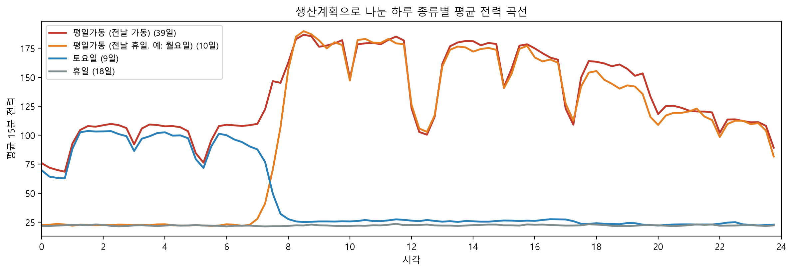

**주:** 평일·전날 가동, 평일·전날 휴일, 토요일, 휴일의 네 곡선이 서로 다르고, 새벽 전력이 전날 가동 여부로 갈린다.

### 그림 A-2. 요일 × 시각별 평균 전력

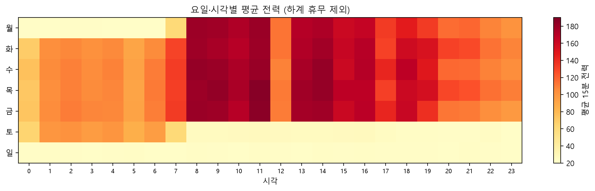

**주:** 평일 주간이 가장 높고, 월요일 새벽은 꺼져 있다.

### 그림 A-3. 하루 최대 전력의 발생 시각

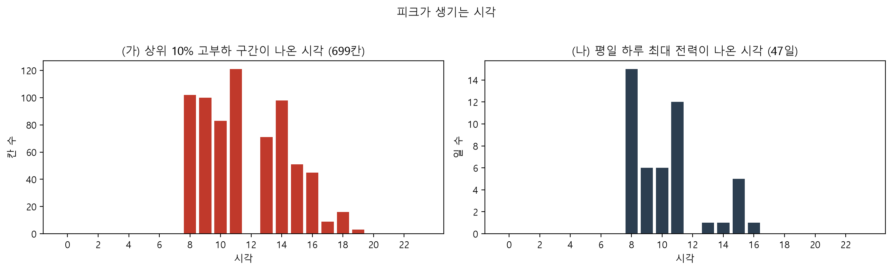

**주:** 08시(가동 직후)와 11시(점심 직전)에 가장 자주 나온다.

### 그림 A-4. 생산량과 전력

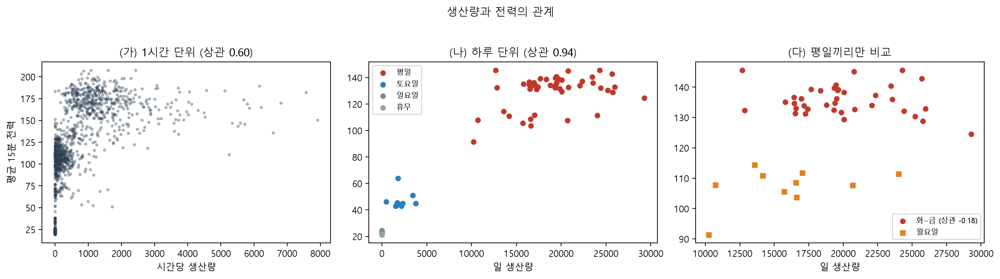

**주:** 하루 단위 상관 0.94는 가동일·휴무일 차이 때문이며, 화~금끼리는 관계가 사라진다(−0.18).

### 그림 A-5. 기온과 전력

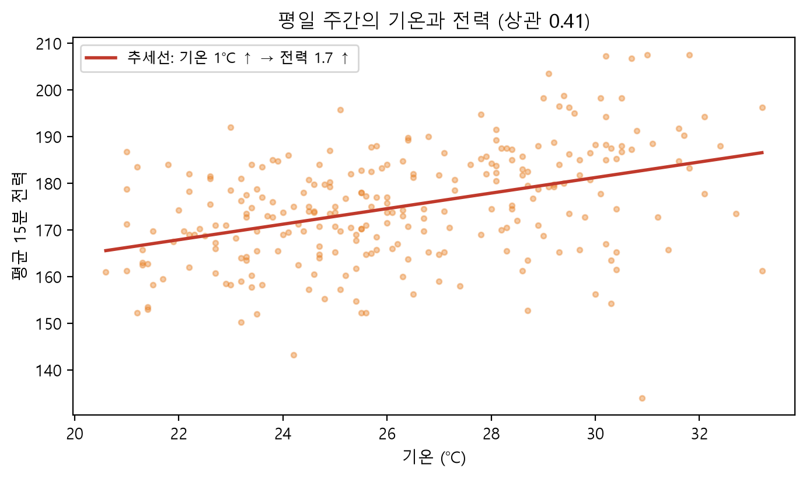

**주:** 평일 주간 1℃당 약 1.7kW 높아 보이지만 시기 차이와 섞인 값이다.

### 그림 A-6. 전체 기간의 일별 전력과 생산량

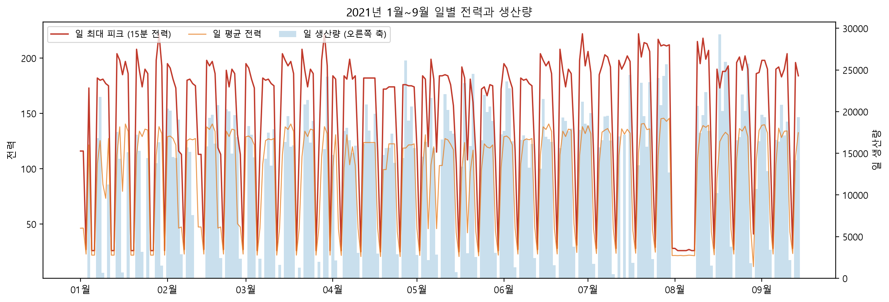

**주:** 1~9월의 일별 최대·평균 전력과 생산량이다. 7/31~8/8 하계 휴무에는 기본 전력만 쓰였다.

### 그림 A-7. 시간 순서가 깨진 날(7/13·7/15)

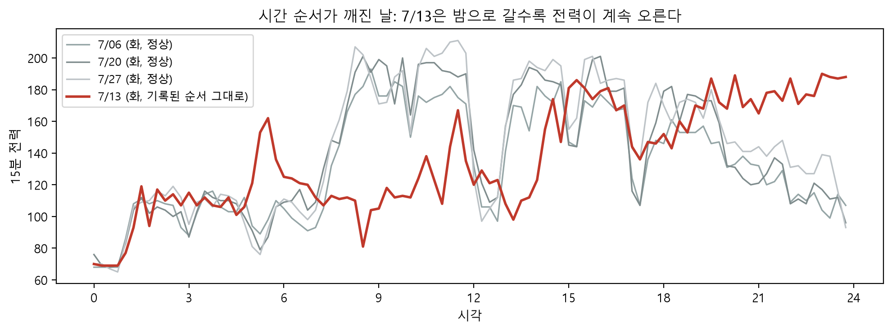

**주:** 시간 열에 그날 전력값이 작은 순서대로 들어 있어 하루 곡선이 비정상이다.

### 그림 A-8. 전력 0 구간(8/28~8/29)

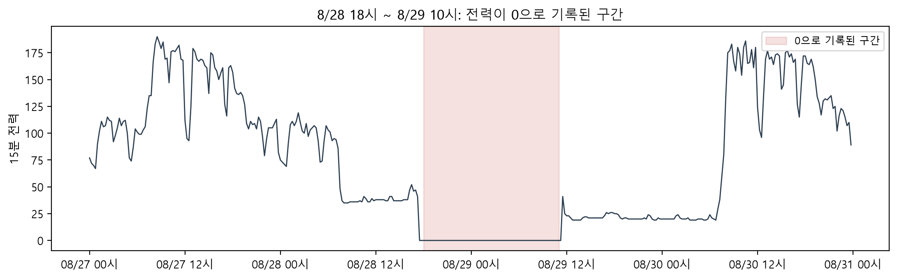

**주:** 약 17시간 연속 0으로, 계측 중단으로 보고 빈 값으로 처리하였다.

### 그림 A-9. 하루 앞 예측의 주별 오차

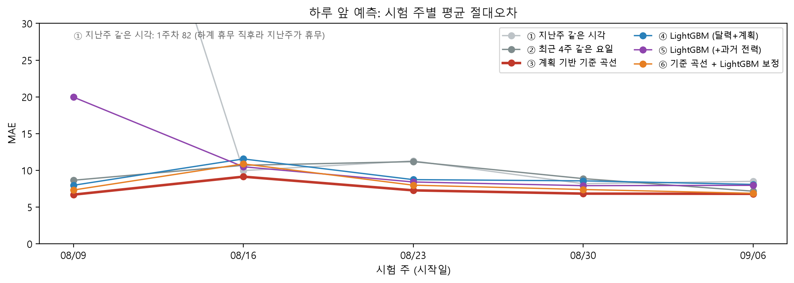

**주:** 지난주 같은 시각은 하계 휴무 직후 1주차에 오차가 80kW를 넘는다.

### 그림 A-10. 1시간 앞 예측의 결합 예(8/16~8/17)

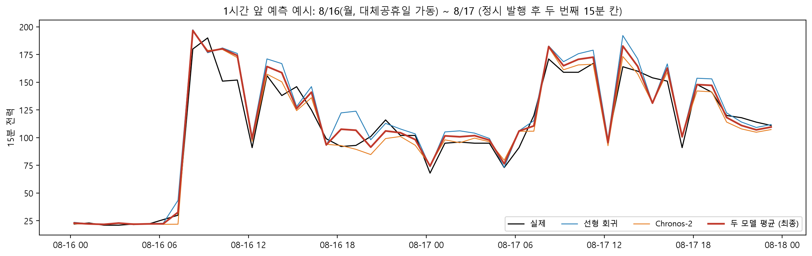

**주:** 8/16(월, 대체공휴일 가동)~8/17의 실제 전력, 선형 회귀, Chronos-2, 두 모델의 평균(최종)이다.

### 그림 A-11. 1시간 앞 경보의 여유값별 성능

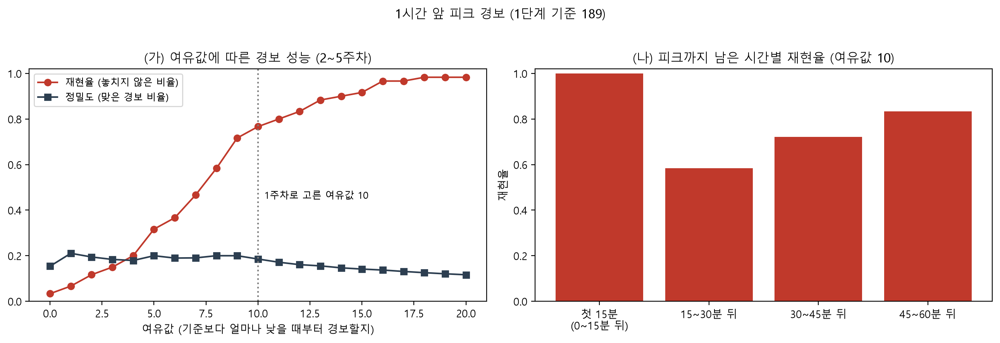

**주:** 여유값을 키우면 재현율이 오르고 경보 수가 늘어난다. 현장이 감당할 경보 수에 맞춰 조정할 수 있다.

### 그림 A-12. 경보 실패 시각

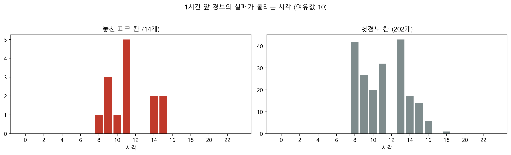

**주:** 놓친 피크는 11시와 14~15시, 헛경보는 08시와 13시에 많다.

### 그림 A-13. 하루 앞 피크 확률

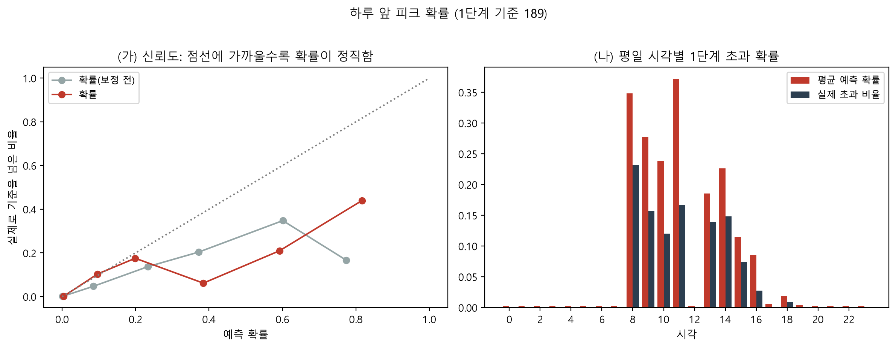

**주:** 위험 시각(08·11·14시)의 순서는 맞지만 확률 크기는 과장되어 있다(예측 평균 0.060, 실제 0.033).

### 그림 A-14. 1시간 앞 예측구간

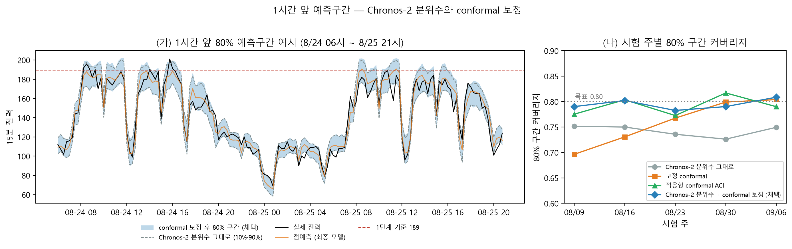

**주:** Chronos-2 분위수에 conformal 보정을 더한 80%·90% 구간이다. 채택한 구간은 5개 시험 주 모두 80% 적중률 0.78~0.81이다.

### 그림 A-15. 영향요인(기온 × 시간대, 계획 생산량)

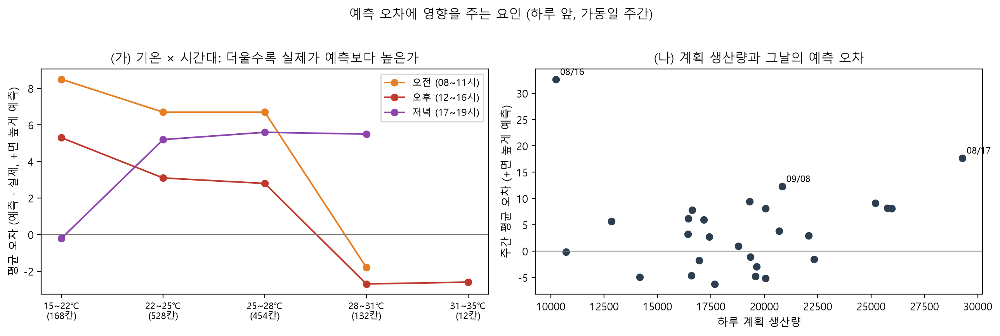

**주:** 기온 구간에 시기가 섞여 있다(3-4). 계획 생산량과 주간 평균 오차의 상관은 0.06이다.

### 그림 A-16. 주간 기온과 하루 최대 전력

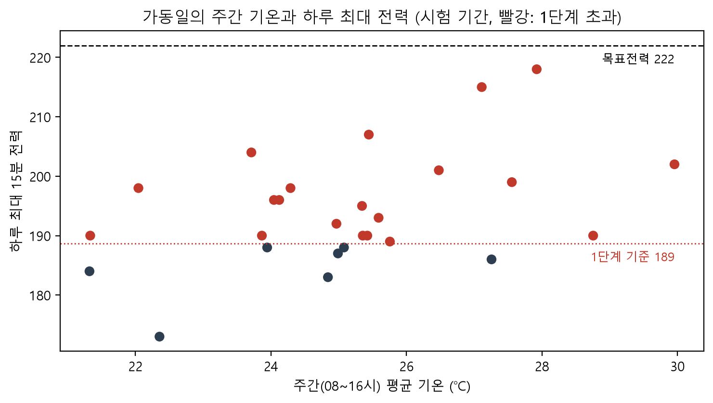

**주:** 가장 높은 두 날(215·218kW)은 27~28℃였지만, 22~24℃인 날에도 198~204kW가 나온다.

### 그림 A-17. 받는 칸 배치 방법별 효과와 안전

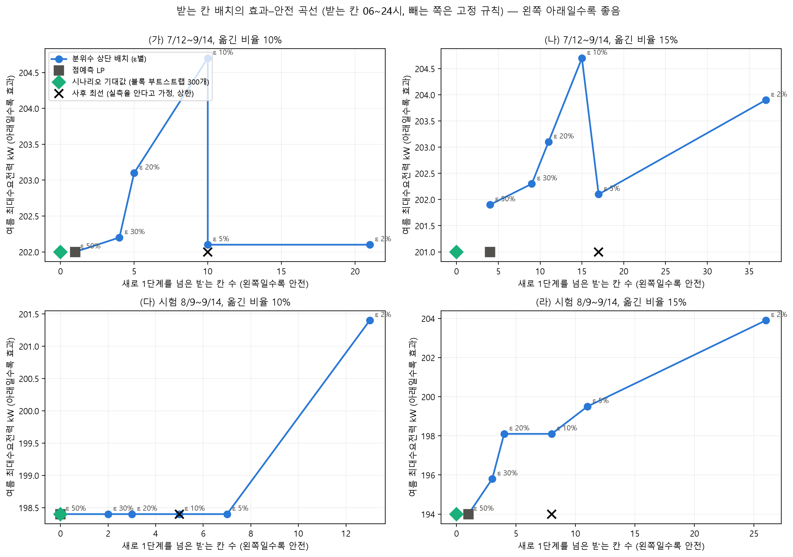

**주:** 평가 대상 칸 기준이다. 시나리오 기대값 배치는 여름 최대를 그대로 두고 새로 넘는 받는 칸을 0칸으로 줄였지만 차이는 우연 범위이고, 보수적 배치(분위수 상단 배치, CVaR90)는 오히려 나빴다.

### 그림 A-18. 규칙 기반 질의응답 도우미

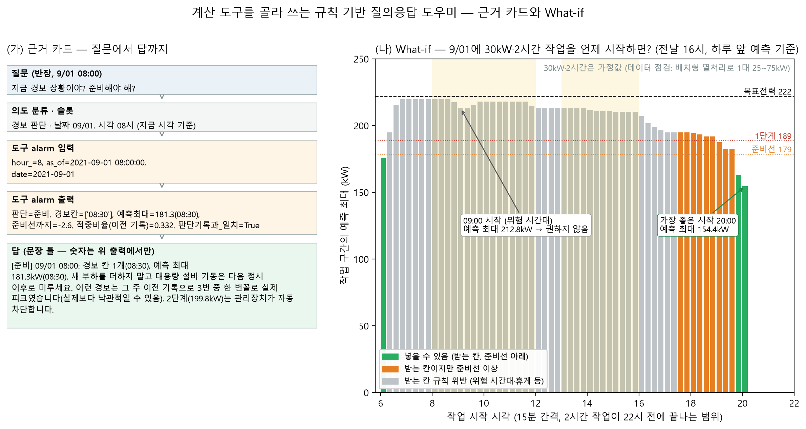

**주:** (가) 질문 → 의도 분류 → 계산 도구 입력·출력 → 답의 근거 카드. (나) 9/01에 30kW·2시간 작업(가정값)을 넣을 때 09:00 시작은 예측 최대 212.8kW라 권하지 않고, 20:00 시작(154.4kW)을 제안한다.

## 부록 C. 방법별 기여와 검증 범위

### C-1. 세부 기여와 비교 근거

**표 C-1. 제안 방법의 기여**

| 기여 | 평가 키워드 | 결과 (비교 대상 → 우리 방법) | 근거 |
|---|---|---|---|
| ① 데이터 이상 발견과 믿을 수 있는 평가 설계 | 데이터 품질, 불확실성 | 1~9월 전체 학습 대비 같은 시험 기간 오차 13.52 → 7.60kW. 날짜 단위 부트스트랩으로 7.10kW 후보를 우연 범위로 판정, 결합 비율을 데이터로 고르면 5.95kW로 나빠짐을 확인 | 1장 표 5, 2장 |
| ② 생산계획·요금 제도의 결합 | 제조 지식 결합, 도메인 | 공휴일 달력 대비 하루 앞 오차 14.47 → 7.32kW. 피크 기준을 약관과 최대전력 관리 방식에서 정함 | 2장 표 9, 1-1 |
| ③ 단순 모델과 사전학습 모델의 역할 구분 | 앙상블·사전학습, 확률 보정 | 1시간 앞 오차 14.48 → 6.26 → 5.85kW. 예측구간 적중률 0.743 → 0.796 | 2장 표 8, 3장 표 13 |
| ④ 예측 한계를 반영한 피크 저감 운영 설계 | 불균형, 최적화 | 경보 칸 하루 20.0 → 11.3칸(정밀도 0.10 → 0.19). 고정 규칙으로 여름 최대 222 → 203.5kW. 받는 시간 최적화는 15%에서 201.0kW(사후 최선과 같음, 옮길 총량을 아는 조건). 줄이는 칸까지 예측으로 고르면 217.3kW, 옮길 총량을 전날 예측으로 정하면 206.4kW | 3장 표 12, 4장 표 16 |
| ⑤ 불확실성·경제성·사용성 검증 | 시뮬레이션, 투자 판단, 의사결정 지원 | 비슷한 전체 준수율에서 절감 0원 확률 9.9% → 0%(4,000회 중 0건). 시나리오 배치로 새 피크 4 → 0칸(우연 범위). 요금제 변경 연 약 162만 원, ESS 추가 순이익 연 약 24만 원(회수 약 8.3년). 질의응답 도우미 질문 46개 모두 맞음 | 4장 표 17 |

### C-2. 모델 설정

LightGBM은 나무 400개, 학습률 0.03, 잎 15개의 설정으로 고정하고 시험 결과에 맞춰 조정하지 않았다. 기준 곡선은 하루 종류·전날 가동 여부·시각별 과거 전력의 평균으로 추정하였다. Chronos-2는 공장 자료로 추가 학습하지 않고 과거 전력과 가동 계획을 입력하였다. 모델 차이의 부트스트랩은 날짜 단위로 2,000회, 규칙 준수의 몬테카를로는 4,000회 수행하였다.

### C-3. 검증과 제출 파일

`tests/test_leakage.py`의 검사 6개는 전력에서 계산된 평균·공장인원 열이 전처리 자료에 남지 않는지, 사용 기간과 제외일이 맞는지, 각 시험 주 이전 자료만으로 하루 앞 예측을 똑같이 다시 만드는지, 1시간 앞 예측의 발행 시각과 대상 시각, 도우미 판단이 발행 시각 이전 정보만 쓰는지 확인한다. `tests/test_peak_helper.py`의 검사 7개는 숫자의 근거, 미래 정보 사용, 지원하지 않는 질문에 대한 거절, 같은 질문의 답변 일관성, 블라인드 금지어를 확인한다. `tests/test_hourly.py`의 검사 5개는 시간 최대 입력의 교란 검사, 확률 보정이 앞선 주만 쓰는지, 제출 파일의 기간과 열을 확인한다. 난수 시드는 고정하고 Chronos-2 가중치 버전을 지정하였으며, 원본 자료와 외부 자료는 SHA-256 해시로 확인한다.

제출 파일은 다음과 같이 구성한다.

| 구분 | 파일 |
|---|---|
| 분석 코드 | `notebooks/`의 노트북 12개와 `peak_helper.py`·`hourly_utils.py`, `run_all.py`, `tests/`, `README.md`, `requirements.txt`, `environment.yml` |
| 원본·외부 데이터 | `data/raw/okm_augumented_2021.csv`, `data/external/`(다른 공장 전력 자료 3개, CC BY 4.0) |
| 결과표와 그림 | `outputs/tables`, `outputs/figures` |
| 예측과 판단 기록 | `outputs/predictions`의 `test_predictions.csv`(테스트 예측결과), `final_day_ahead.csv`, `final_hour_ahead.csv`, `decision_log.csv` |
| 부록 | `appendix/hourly_max_pipeline/` |

